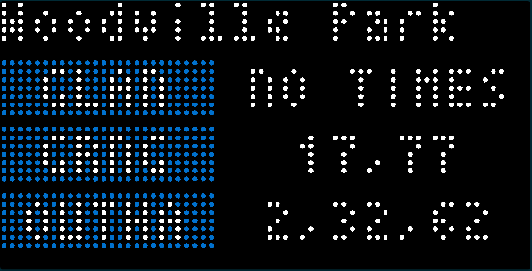
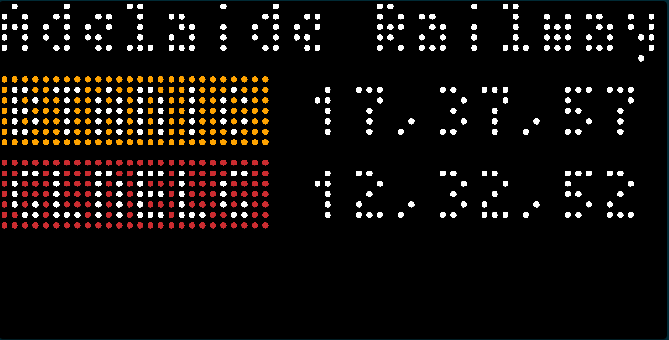

Inspired by all the other great transit apps out there, I made one for my home town. I'd be surprised if anyone actually uses it though :)

You can choose from train, tram or bus services and select the station for train or stop for trams. For the bus, you will need to enter the Stop ID which you can get from the Adelaide Metro website - http://www.adelaidemetro.com.au or should be written on the stop sign itself. For the train, you will need to select the direction you are heading with service to Adelaide being the default. 

Train 

Tram

Bus

