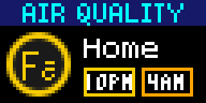

# Air Quality

## Overview

This app uses the [OpenWeather Air Pollution API](https://openweathermap.org/api/air-pollution) to show the current Air Quality Index (AQI) of a given location.

The AQI ranges from 1 to 5, meaning:

1. Good condition
2. Fair condition
3. Moderate condition
4. Poor condition
5. Very poor condition

The app displays the current AQI and forecasts for the next 6 and 12 hours:

---

## API Details

We currently use the [forecast endpoint](https://openweathermap.org/api/air-pollution#forecast). It gives us the current conditions as well as a 4 day hour-by-hour forecast, from which we pick the results for the next 6 and 12 hours.

### Authentication

OpenWeather requires an API key to work. You can sign-up for a free account and create as many keys as you need.

_Note: to run the code locally you will need to sign-up and provide a key in the `OW_DEV_API_KEY` variable._

### Rate Limiting

The API is rate limited, the free plan supports 60 calls/minute, and a total of 1 million calls per month.

We currently cache the results for 6 hours. This means that each installation will require at most 4 calls each day. At this rate, we can support around 5,500 installations without reaching the monthly limit.

---

## Configuration (Schema)

The app supports many configuration options. Since this is a geolocation based service, the user needs to provide a location via the `Location` widget.

The user can also override the name of the displayed location (to show something meaningfule like "Home" or "Office"), customize the colors for each AQI level and choose to scroll the description of the current AQI level or not.

---

## Error Handling

The app has safeguards in place to identify potential errors and always display something on the screen. For instance, API errors will display an "Unknown" AQI level.

The only situation where `fail` is called is if you try to run the app locally without providing an API key in the `OW_DEV_API_KEY` variable.

---

## Future Improvements

The OpenWeather API returns other meaningful data about polluting gases, which are used to calculate the AQI level.

We found it hard to display this data in the app because of the size constraints and to avoid the excessive use of `Marquee` widgets.

This is something that can be further explored in the future, by adding an option to let the user choose between the forecast or this "detailed" view (similar to the Strava app).
