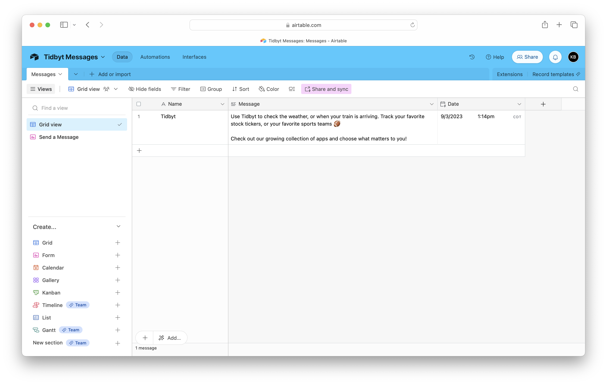
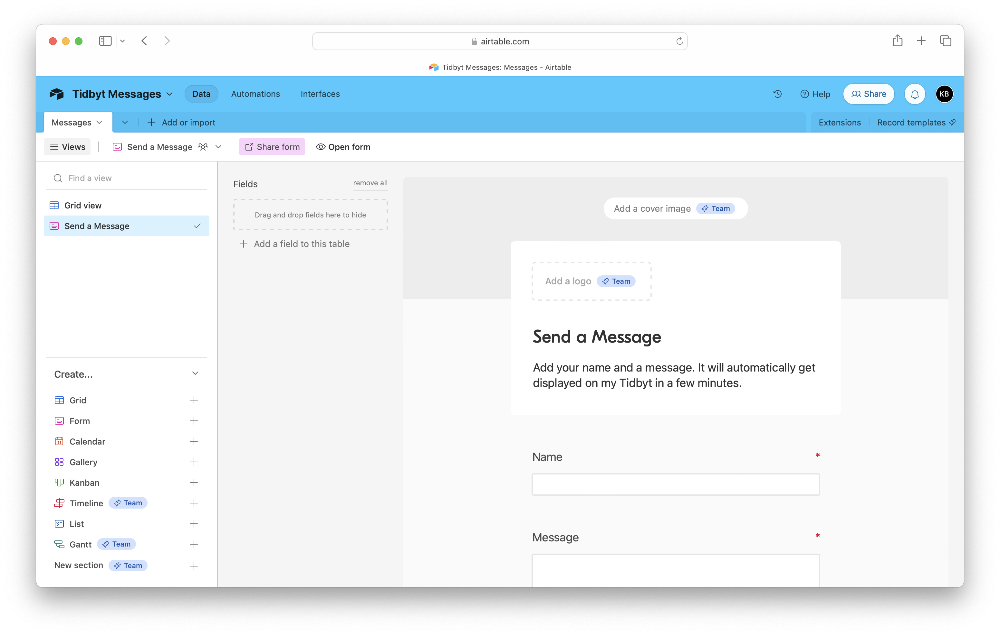
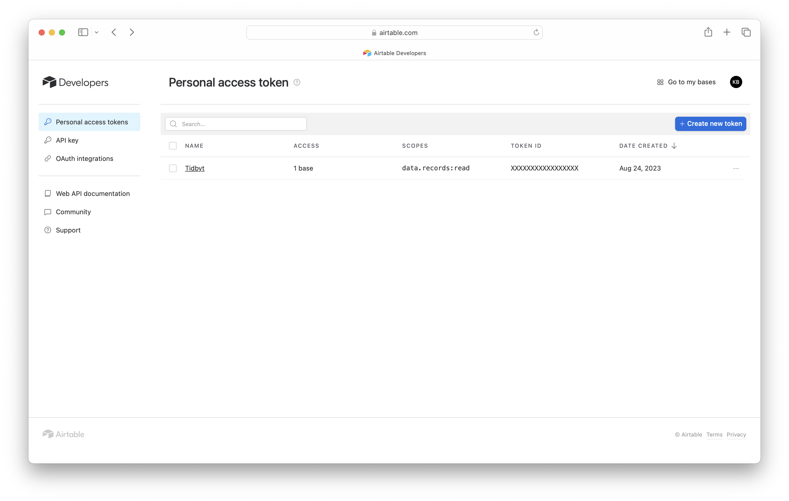
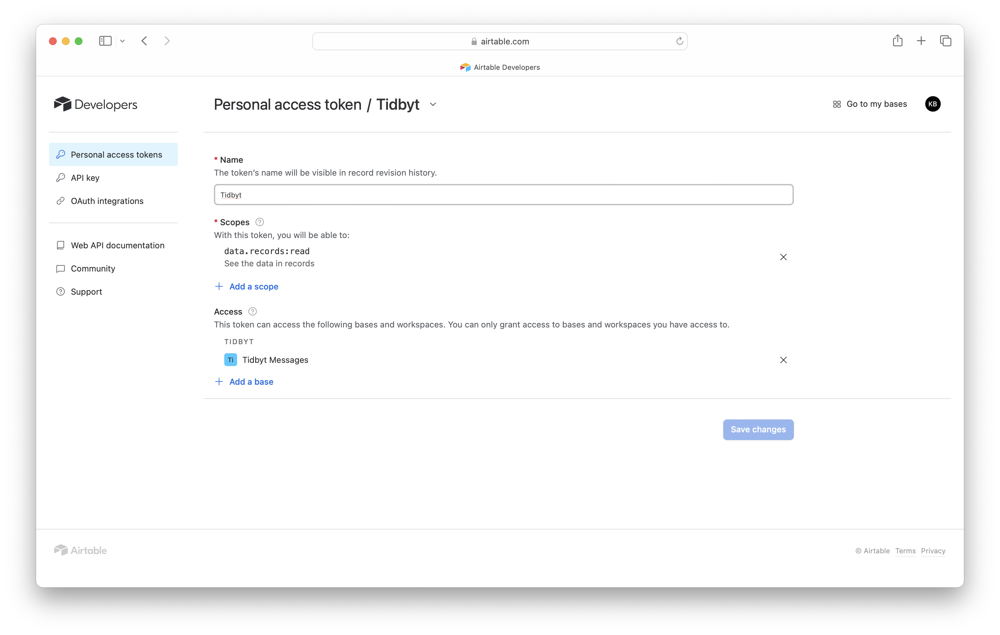

# Airtable Messages for Tidbyt

Display a scrolling message sent via an Airtable form. Emojis in Unicode v15.0 are accepted but not guaranteed. Emoji Sequences are not (yet) supported. No user data is stored outside of Airtable. There are several configuration options to meet many different types of needs.

## Caveats

All characters are attempted to be displayed on the Tidbyt. Different fonts can (and will) render different sets of characters. [Emojis in Unicode v15.0](https://util.unicode.org/UnicodeJsps/list-unicodeset.jsp?a=%5B%3AEmoji%3DYes%3A%5D&abb=on&c=on&ucd=on&esc=on) are supported no matter which font is selected!

## Schema
>>>
name =  "Airtable API Token", desc =  "Airtable API Token"

name =  "Airtable Base ID", desc =  "Airtable Base ID"

name =  "Airtable Table ID", desc =  "Airtable Table ID"

name =  "Author Text Color", desc =  "The text color of the author"

name =  "Author Font", desc =  "The font for the author"

name =  "Separator Line Color", desc =  "The color of the separator line"

name =  "Message Text Color", desc =  "The text color of the message"

name =  "Message Font", desc =  "The font for the message"

name =  "Max Age", desc =  "The number of seconds to consider a message to be recent"

name =  "Random Message", desc =  "Show a random message if no recent messages are found"

name =  "Show Unicode", desc =  "Show the Unicode icon or name (or nothing at all) for any unsupported characters (e.g. emoji)"

name =  "Emoji Size", desc =  "Set the size of emoji icons"

name =  "Scrolling Speed", desc =  "Set the speed of scrolling (when applicable)"

## Requirements

An Airtable account is required. A free plan is acceptable.

Create a table with the following fields (and field types):

- Name (Single line text)
- Message (Long text)
- Date (Created time)

Create a form that uses the following fields:

- Name
- Message

Enter the following parameters into the Airtable Messages for Tidbyt app:

- Airtable API Token
- Airtable Base ID
- Airtable Table ID

A [personal access token](https://airtable.com/developers/web/guides/personal-access-tokens) is recommended to authenticate requests to Airtable's API.

The Airtable Base ID and Airtable Table ID can be found under Help > API documentation.

## Screenshots

