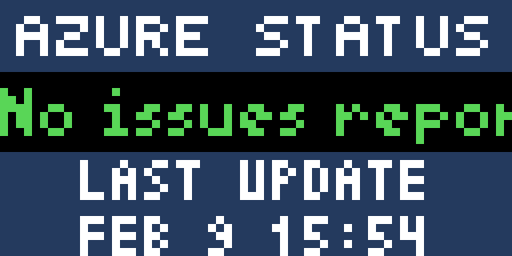

After a couple recent Azure outages, I decided to make a simple app that looks at the Azure Status RSS feed and shows the latest incident and time of the last update. It just shows the title of the incident, you will need to go to https://status.azure.com/en-us/status to get more info

Issue:

All is well:

