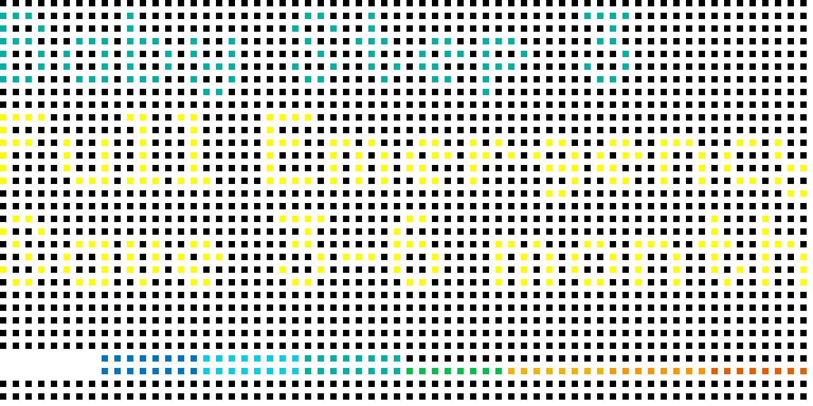

# Baby Steps for Tidbyt

Dave Ramsey has 7 Baby Steps to financial freedom.

If you are working on these baby steps, it might be helpful to add a reminder to your Tidbyt to keep you motivated to reach financial peace.

You can update the app settings as you progress through the steps, or have the app display a random step each time.

The lines at the bottom represent your progress through the baby steps.

I've added a "Step 0" which means you are just preparing to get started, there are some pre-requisites to work on, and you can move to Step 1 when you start working on your emergency fund.

