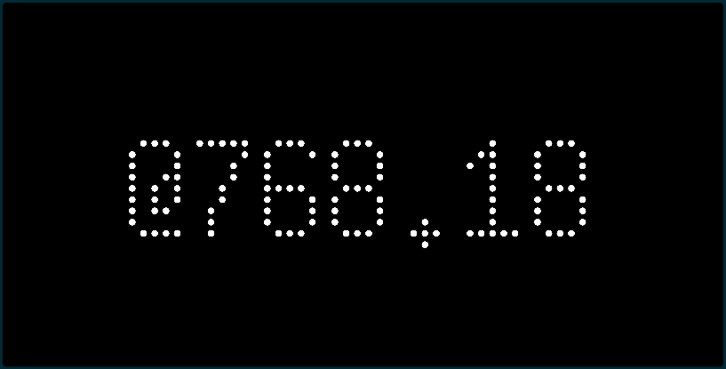

# Beat Time

Display the time in _.beats_, a decimal time format also known as [Swatch Internet Time](https://en.wikipedia.org/wiki/Swatch_Internet_Time)

## Configuration
- Toggle whether or not to display centibeats (fractions of a .beat) (Default: `True`)

## About Swatch Internet Time

Swatch Internet Time is a decimal time format where the day is divided into 1000 _.beats_. Each .beat lasts 86.4 seconds.

Midnight is defined as UTC+1, and there are no timezones, because there are no timezones on the Internet. 

The current time uses the notation `@XXX.yy`. 
- `XXX` is the current number of beats since midnight in UTC+1
- `yy` is the current number of _centibeats_ since the current .beat

Centibeats are not part of the original standard, but are included to provide something a little more animated.

## Screenshot

