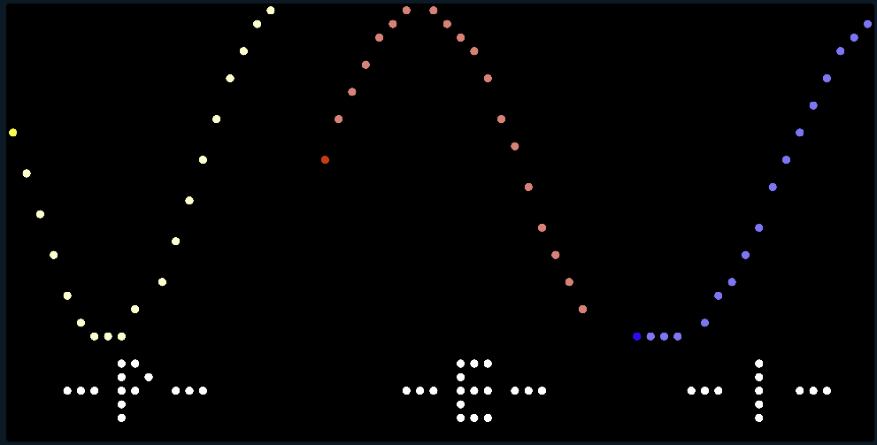

## Biorhythm

---

This app renders the physical (<b>P</b>), emotional (<b>E</b>), and intellectual (<b>I</b>) biorhythm curves based on your birthdate.
 
The idea of biorhythm theory was developed by Wilhelm Fliess in the late 19th century.  It is based on the *pseudoscientific* idea that our lives are significantly affected by rythmic cycles. They consist of a 23-day physical cycle, a 28-day emotional cycle, and a 33-day intellectual cycle. Biorhythms were popular in the United States during the late 1970s.

This idea has been independently tested and invalidated.  It is a fun theory that can be used for your amusement.  It's been said that it is very useful for giving an excuse for locking your keys in the car or blowing off your workout.

In each of the displayed curves, the darker first point is for today.

The schema data is your birthday.  If no date is entered, then today is used as the default birthday.

