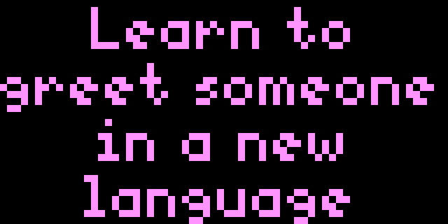
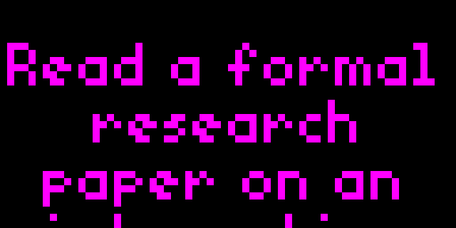

# Bored

## Releases

### Version 2.0001
WOOOOAAA now you can enter your OWN suggestions for things to do, thus greatly surprising your family with customized things like "Go clean your room young man", or "Sexy time with Bruno" to mention a few. The opportunities for never being bored has never been greater. Let the great Un-Boredom project commence.

### Version 2.0
Oh My, the Goodness has been squared. Now with customizable scroll speed, and an option to always show the entire suggestion. Bored People, UNITE.

### Version 1.0
Fun, but rudimentary, yet excitingly uplifting, like eating hotdogs with chillies.

## The Problem

There comes a time in a persons life when we are faced with some of the hardest choices humans can face. Choices so stark it shakes our very foundation, ripping the very fabric of reality. Choices that will forever change our lives going forward. Choices that can't be undone.

I am of course talking about the Mother of all choices...

**I'm Bored, what should I do next?**

As you face this monumental decision, your mind wanders to the far realms of reality, struggling to cope with consequences of what might be. Soon, you are paralyzed by the sheer amount of possibilities, unable to choose, your brain shuts down and the vicious circle begins.

## The Solution

We present the clear and obvious choice for your boredom: Let Tidbyt decide.

With the Bored App, your brain gets a one way ticket to easy-street, and by simply glancing at the Tidbyt, you instantly know what you have to do. There is no thinking, just doing.

## Setup

The Bored App has a number of exceptionally well thought out settings. Settings to insane you will wonder why Apple has not copied them (It's just a matter of time). Settings like...
 
- Choosing the color of your text ! That's right, you can select your very own color from a number of option ranging from Yellow, to Green, or even Purple. It's pure insanity.
- Choose how many people are bored. Is it just you, or is it an entire swarm of people. Perhaps just you and your significant other (or a friend). The choices are almost endless (there are four choices).
- Presentation. That's right baby, should your suggestion scroll UP or Sideways ! BOOM, you get to decide. And if you change your mind, we'll let you change your choice. That's how we roll, and be 'we' I mean me, cause I made this little puddle of awesomeness.

## Demo

_BEHOLD Peasants_ (And shudder in the presence of **eternal wisdom**)

 

## Technically Speaking

This app was built by an highly skilled professional. Any attempt to tamper with this app, or otherwise reverse engineer is done at your own risk. The comments in the code uses professional terms such as "this may not work", or "and then this does some stuff", which can be hard to understand for the layman. Software developers with less than 15 years experience may not fully comprehend the intricacies and technical complexities contained within the lines of code. Once you look, all warranties are considered null and void.

## Thanks

None of this coding magic, this bundle of cool, this structure of perfection, would have been possible without the API developed by the wizards of [Bored API](https://boredapi.com), who has collected this eternal wisdom from the crowds. In fact, you can go there, and add to their collection, and perhaps, maybe, perchance, someday YOUR suggestion might show up on a Tidbyt, forever changing the course of history as the next Albert Einstein goes to vacuum his shed.

I'd also like to thank The Academy for reaching out, but I am unable to host this year.

## Donations

No, please, I couldn't. I know you want to send me some mullah, but this is purely for the betterment of society. For the greater good if you will. Keep your money and your cupcakes, and spend it with your other bored friends.

_Sincerely_

Anders Heie