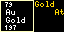

# Chemical Elements for Tidbyt

Created by: Robert Ison

Displays one of the chemical elements at a time.

Pick to display a random element each time the app runs or have one new element appear each day, such that after 118 days, you'll have seen every element once, then start over.

Once an element is picked for display, the Atomic Number, Symbol, name and atomic weight will appear as it would in a periodic table.

In addition, plain English display of more details will appear on the right side of the screen.

