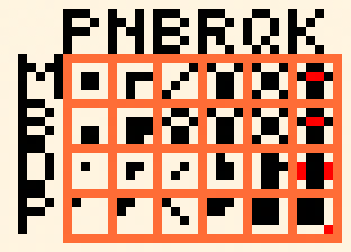

# Chess Viewer App for Tidbyt

Displays currently active games from [Chess.com](chess.com) for the username provided. If no username is provided, the app shows famous chess games from history. The chess piece graphics can be changed via the Piece Theme setting and the board graphics can be changed via the Board Theme setting. The king piece for each side has a special color added to distinguish it from the other pieces. The "minim" piece theme is the default theme and is considered to be the most readable on the Tidbyt. The player whose turn it is to move has an asterisk next to it. The advantage in material in points is shown next to each color:

## Piece Values in Chess
* Pawn: 1 point
* Knight: 3 points
* Bishop: 3 points
* Rook: 5 points
* Queen: 9 points

## Available Board Themes:
* Summer (default) - Reddish orange
* Fall - Brown
* Winter - Blue
* Spring - Green

## Available Piece Themes:
* Minim (default) - Most readable and intuitive.
* Block - A variation on the Minim theme.
* Dot - A more abstract minimal theme.
* Point - Abstract theme that matches each piece with its point value. The number of pixels in each piece design is equal to its material point value. All pieces are drawn in the top right corner to reduce confusion when two pieces are directly next to each other. The king has a total of 10 pixels but can be distinguished by its special color dot.

The name shown is the opponent's username as well as what color that user is playing in the game shown.
Enjoy!

