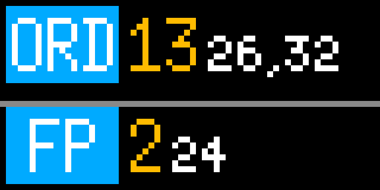

# Chi L Track

### Chicago CTA L Tracker - Station arrival board

An arrival board for your favorite 'L' station.

### Features
* Two "slots" (top/bottom) on your Tidbyt's screen
	* Each slot can show one L route's arrivals at a specific station
	* Slots can be configured to be different stations
	* Each slot is color coded with your line color and train's direction name (or rather acronym)
* Shows multiple upcoming arrivals 
	* First upcoming arrival is in larger, orange font
	* Subsequent arrivals are in small font
	* Trains that are marked as delayed are shown in red
	* On some lines, you might see a suffix after each arrival that denotes an alternate destination
		* e.g. Blue line trains to UIC/Halstead will have "U" after the number
	* A "!" suffix means the train is showing a non-standard destination (e.g. during construction)
* Option to filter out "scheduled" trains
	* CTA's train schedule is notoriously inaccurate, so by default only live-tracked trains are shown. This may however not work too well near train terminus as trains aren't live tracked until they leave the first station.
	* For this case, it might be good to turn on "show scheduled trains" option.
	* Scheduled trains are shown in a grey font
* Animated train separating the slots
	* This can be turned off in app configuration

