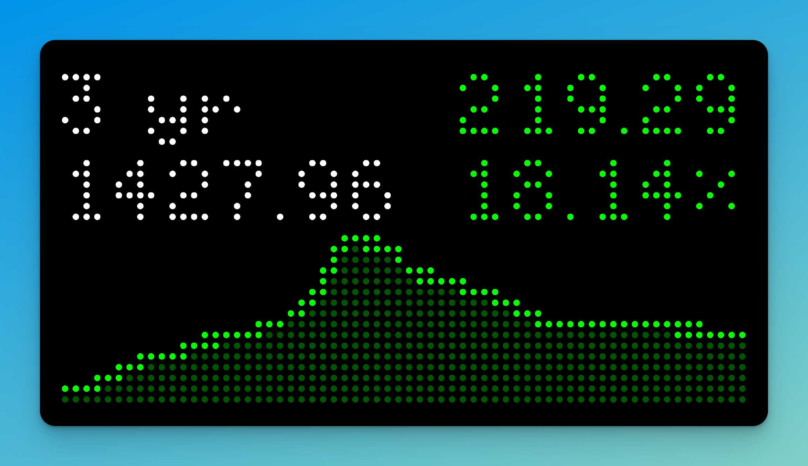

# Chrono24

This Chrono24 app shows two different views.

- Overall market performance
- Top 10 watches in the index

These data points are on a configurable time frame:

- 1 month
- 3 months
- 6 months
- 1 year
- 3 years
- Max

## Configuration

| Title     | Description                                           | Required | Default             |
| --------- | ----------------------------------------------------- | -------- | ------------------- |
| Timeframe | Timeframe the data fetches                            | No       | 1 month             |
| View type | Show either the market view or individual watch index | No       | Overall market view |
