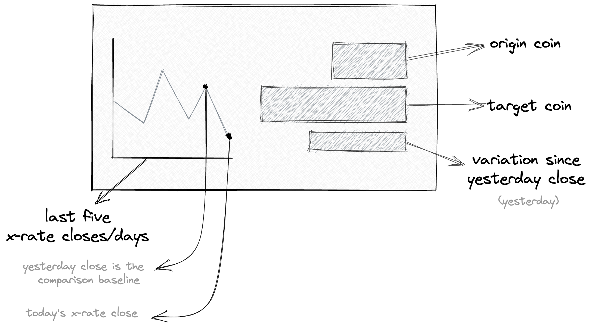

## Motivation

Display one exchange rate against another of your choice on your Tidbyt. Data provided by [AwesomeAPI](https://docs.awesomeapi.com.br/). As the Brazilian community grows, this Applet support BRL currency so you can check it against USD or EUR.

### Available Options

With the dynamic schema fields you can:

| Name              | Description                                              | Default |
| ----------------- | -------------------------------------------------------- | ------- |
| `From`            | Change origin coin                                       | `BRL`   |
| `To`              | Change target coin                                       | `USD`   |
| `Precision`       | Choose your desired number of decimal points for prices  | 2       |
| `Exchange spread` | Change between your desired Exchange spread (bid or ask) | `Bid`   |

### Applet Anatomy

