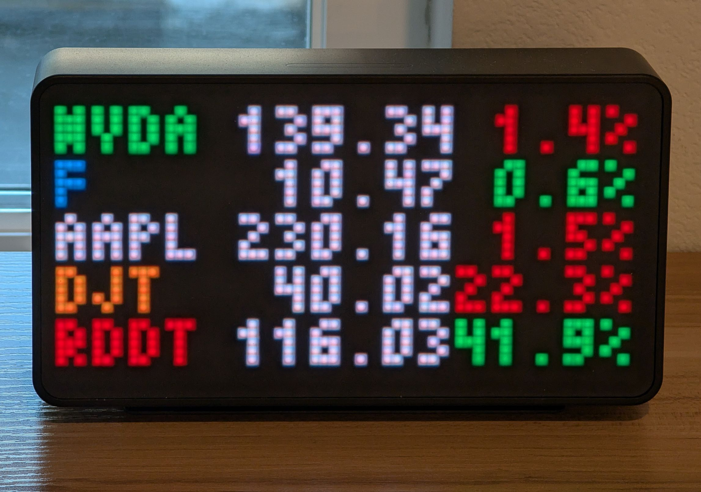

# Compact Stocks for Tidbyt

This is a simple stock ticker app for [Tidbyt](https://tidbyt.com/) that shows the current prices & daily changes for 5 stocks of your choice. Data is provided by https://apistocks.com/ and updated once every hour. **You need to sign up for a free API key on RapidAPI to use this app.**

## Deployment

Check out the official [Tidbyt documentation](https://tidbyt.dev/docs/) for instructions.

## Update frequency

The app fetches new data once an hour. This interval is chosen because the free tier of APIStocks allows 5000 requests per month. Considering that we are showing 5 stocks, that's 1000 requests per stock per month, which is about once an hour. If you have a paid subscription and can afford more frequent updates, you can change the interval by modifying the `TTL_SECONDS` variable.
