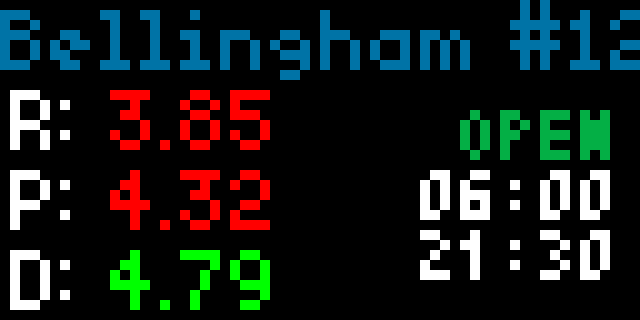

# Costco Gas Applet for Tidbyt

Displays current gas prices for a selected [Costco](https://www.costco.com) warehouse in the US.

## Features

* Using an entered address, choose from a list of the nearest 20 warehouses with gas stations
* The applet will display the price for Regular (R), Premium (P), and if available, Diesel (D)
* Choose the colour scheme for gas prices: all white, red for gas/petrol and green for diesel, or green for gas/petrol and red for diesel
* Choose to display an icon (Costco logo or Gas Pump logo) or opening hours
* Opening hours will reference your device timezone ($tz) to determine the current day and open status of the gas station
  * Device will display OPEN or CLOSED (based on current time) followed by the opening and closing times
  * Choose to display times in 24-hour clock (default) or 12-hour clock

**Default display:**

**Display with price colour and opening hours:**

## Data Source

Data is being sourced from the Costco Website Warehouse Finder API and as provided AS-IS only. Website updates made by Costco may cause this app to fail and may require updates. 

Even though gas (petrol) stations are available in other countries like Canada and the UK, only US warehouses reliably return prices at the present time.