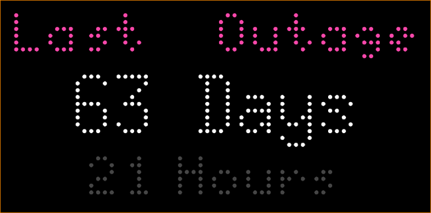
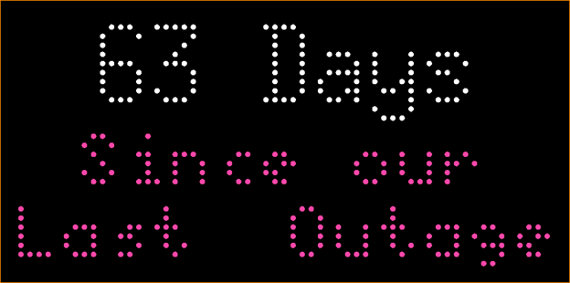
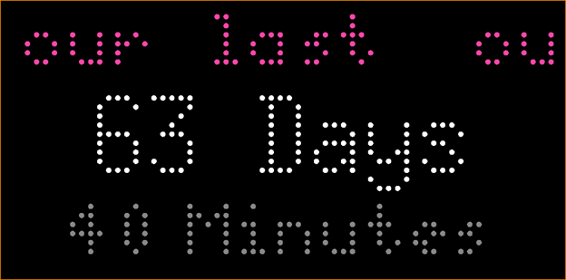

# Countup Clock

Shows title and elapsed time since a defined date and time

Displayed:

- Title (above or below elapsted time)
- Days since event
- Hours since event (optional)
- Minutes since event (optional, only available if hours is selected)

## Configuration
- Set title, position of title and title color
- Set event date
- Turn on/off display of hours
- Turn on/off display of minutes

## Thanks

Thanks a lot to @CubsAaron for [Count Down Clock](../countdownclock/) as it was the inspiration, plus I used the fade/in out code for when hours and minutes is displayed - genius technique. 

## Screenshot

