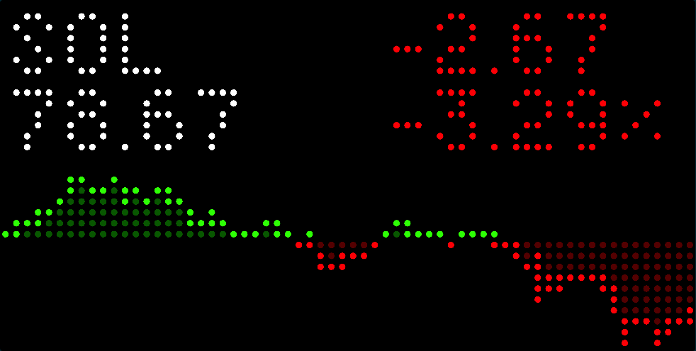

# Crypto Tracker for Tidbyt

Displays one of 5 24-hour cryptocurrency price charts in USD on your Tidbyt. Includes Bitcoin, Ethereum, Binance Coin, Cardano and Solana. Clockwise from symbol is 24-hour price change, 24-hour percentage, and current price. Below this is a 24-hour price graph. Data is provided by [AlphaVantage](https://www.alphavantage.co/documentation/#crypto-intraday) and updated every 15 minutes. No API key required currently.

## Feature Ideas

- Add cryptocurrencies to list and add formatting for changes that are less than a cent for cryptos worth less than 10 cents.
- Find API for commodity tracking and add support.

Thanks to [AlphaVantage](https://www.alphavantage.co/) for API access!
