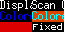

# CSV Viewer

This applet allows you to display CSV data from any online CSV file such as a published Google Sheet.


## Text and background coloring

You can change the color of the text or the background color of a cell by specifying those in the CSV data. The default text color is white, and the default background color is black.

If the text ends in something that looks like a hex color (`#FFF`, `#FFFF`, `#00FF00FF`, or `#00FF00`), that is interpteted as the background color.

If the text ends in hex two colors in a row (`#FFF#FFF`, `#FFFF#FFFF`, `#00FF00#00FF00`, or `#00FF00FF#00FF00FF`), the first color will be interpreted as the text color, and the second color will be interpreted as the background color.

For each of the coloring options, only the text before the color will be displayed.

A hex color is defined by Tidbyt to be anything that looks like either a 3, 4, 6, or 8 letter hexidecimal color. For the 4 and 8 letter colors, the last data value is the alpha. Hexidecimal colors are not case sensitive.

### Examples of text and background coloring

[This is the link to the default CSV file that is displayed by the app.](https://bit.ly/tidbyt-csv-viewer)

[This CSV file is published and can be accessed here (linked - note that this link will likely start a CSV file download).](https://docs.google.com/spreadsheets/d/e/2PACX-1vSkZW0qyS1HpnPh5V51mBPZNjiNFJEZUjrLlwlfrscjDmMHqNyKQ1sjfj791t0f-_XE8g6d5MnSosLE/pub?gid=0&single=true&output=csv)

| CSV Data | Text | Text color | Background color
| - | - | - | -
| `Just text` | `Just text` | Default (white) | Default (black)
| `#00F` | None (will apear as a colored rectangle) | N/A | [`#00f` (blue)](https://www.hexcolortool.com/#00f)
| `Colored text#00d#000` | `Colored text` (black background) | [`#00d` (dark blue)](https://www.hexcolortool.com/#00d) | [`#000` (black)](https://www.hexcolortool.com/#000)
| `Colored background and text#0ff#d40` | `Colored background and text` | [`#0ff` (cyan)](https://www.hexcolortool.com/#0ff) | [`#d40` (pink)](https://www.hexcolortool.com/#d40)

### Default screen

{:height="200px" width="400px"}

This is the CSV that was used to generate that:
```csv
Display arbitrary text from a CSV,Scan QR for example published Google Sheet
Colored text#00d#000,Colored background and text#0ff#d40
#d00,Fixed
```

This is that CSV formatted nicely:

| `Display arbitrary text from a CSV` | `Scan QR for example published Google Sheet`
| - | - |
| `Colored text#00d#000` | `Colored background and text#0ff#d40`
| `#d00` | `Fixed`

## Options

In addition to the CSV URL that you must provide, the following options are available:
- **Row and column count**/: The number of rows/columns of the data to display. Defaults to the number of rows/columns available in the data
- **Row and column offset**: The number of rows/columns to offset the view by. This allows you to skip header rows or columns if they are present. Defaults to 0.
- **Avoid scrolling text**: By default, the text will be maximized to fit vertically in the available space depending on the number of rows/columns available. If this option is selected, a smaller font size will be chosen if it would mean that the text would fit horizontally and scrolling could be avoided.