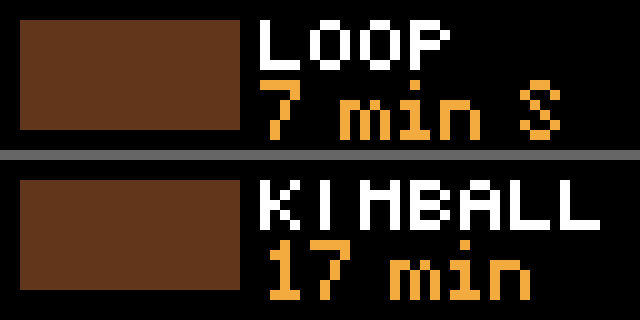

# CTA "L" Tracker Applet for Tidbyt

Displays the two next arriving trains and their estimated arrival times for a selected Chicago "L" Train station. Live CTA arrival data is provided by the [CTA Train Tracker API](https://www.transitchicago.com/developers/ttdocs/).
The list of "L" stations is provided by the [City of Chicago List of "L" Stops API](https://data.cityofchicago.org/Transportation/CTA-System-Information-List-of-L-Stops/8pix-ypme).

