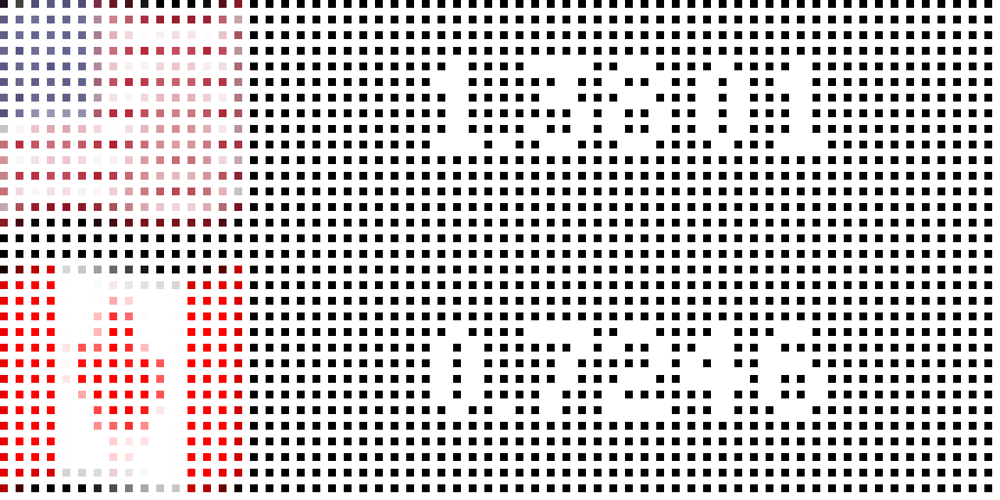

# Currency Converter for Tidbyt

Created by: Robert Ison

Displays the exchange rate of two currencies.

Pick your local currency (or any other currency you'd like really) and pick a currency to get the exchange rate for.
You'll see the flag associated with each currency, and the number of units of the displayed currency in terms of the other.

This data comes from ExchangeRate-API.com
Documentation is available here: https://www.exchangerate-api.com/docs
Terms of use is here: https://www.exchangerate-api.com/terms

This program will cache exchange rates for a given location for 5 minutes after the posted "Next Update" in the feed which is about 1 full day.

A free account with this site allows 1500 API calls a month, or about 50 per day.
So we should be good with a free account until we have 50 different currencies being listed across all devices.
In that case, we can simply remove options for all but the 50 most popular countries. However, my guess is fewer than 50 of the listed 140+ will ever be used until Tidbyts are sold in every country of the world.

