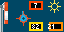

# CycleCast for Tidbyt

Displays weather information at a glance to quickly size up if it's a nice time for a bike ride (or any other outdoor activity).

Displays a windsock to show how strong the wind is, a windrose to show the direction the wind is coming from. 

Also shows UV Index, Temperature and Humidity values in a color-coded box. 

Also the sun or moon (in the correct phase no less) as well as clouds, or rainclouds as appropriate. 

