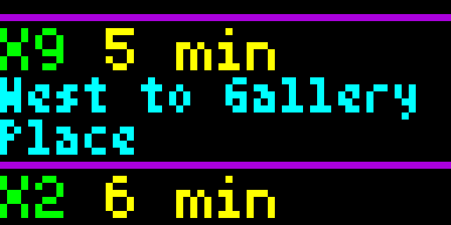

# DC (WMATA) Bus Arrival Times

This app utilizes an API provided by WMATA to display the next several bus arrival times for up to two user-specified DC Metro bus stops.

The desired bus stop(s) are specified using the 7-digit Bus ID Number displayed on the bus stop sign located at the bus stop (e.g. 1001155).  Bus ID #1 is required while Bus ID #2 is optional.  An online search of Bus ID numbers can also be made by visiting the following address:

https://gis.wmata.com/mbsi/default.htm#regID=1001011

Optional "Show Details" toggle allows detailed bus route information to be displayed as well as arrival time(s).

