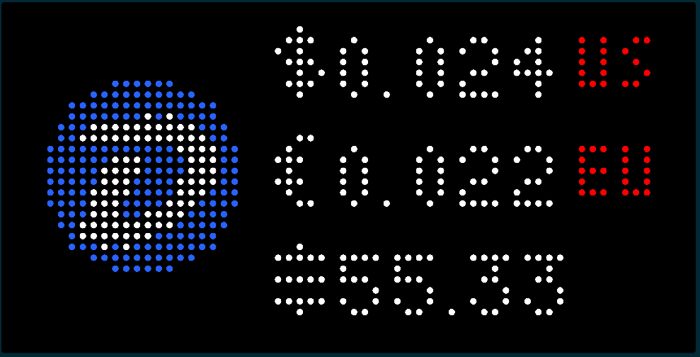

# DigiByte Price Applet for Tidbyt

Displays the current [DigiByte](https://digibyte.org/) price on your Tidbyt in up to two fiat currencies and/or in SATS. Data provided by [CoinGecko](https://www.coingecko.com/). Updated every 10 minutes. No API key required. Uses the [Satoshi Symbol](https://satsymbol.com/).

