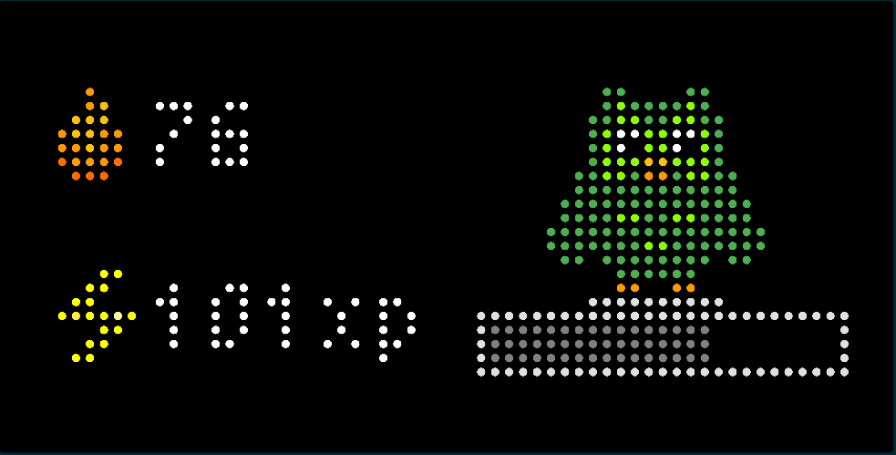
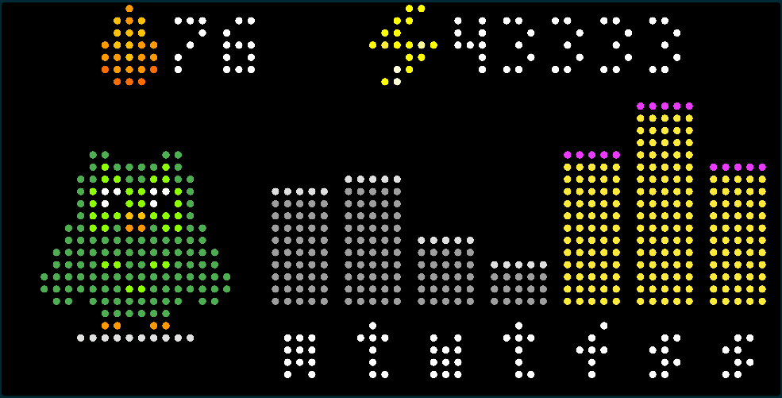
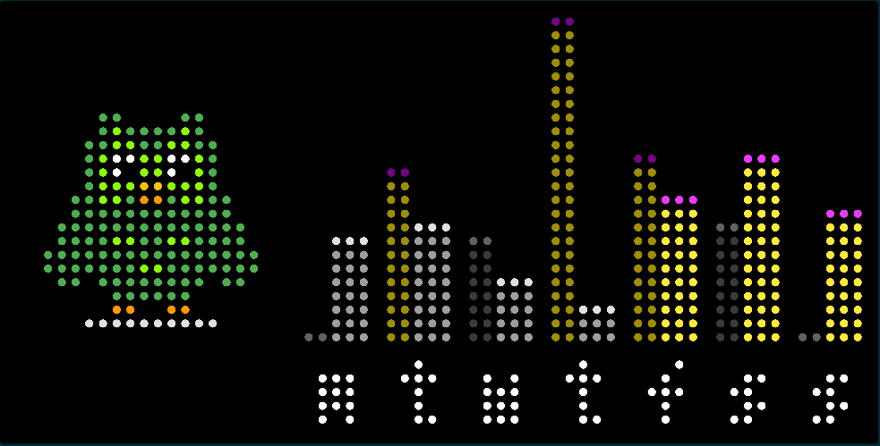

# Duolingo Dashboard for Tidbyt

This applet provides a user dashboard for [Duolingo](https://www.duolingo.com/). The app has three possible displays views - the user can add multiple instances of the app if they want to display more than one.

**Daily View**
The 'Daily' view shows the progress towards a daily XP goal, which can be selected by the user in the schema. The daily XP goal set in the Duolingo app is ignored. The progress bar shows how far they have progressed towards that goal. It also displays the current XP score and their current Streak.

**Week View**
This displays a chart showing the daily scores achieved over the last week. The bars are grey if the daily goal was not achieved, and gold for when it was. There is an option in the Schema to display extra chat stats if desired, which add a bar to the top of the screen with the current Streak, and the user's current total XP score, or the XP score for the current chart duration (week/fortnight)

**Two Week View**
This is the same as the week view but includes the previous week's data as well.

Other features:
- The app will hide iself from the rotation if no lesson has been completed within the last week.

Notes: Duolingo's API is undocumented so who knows when/if this might break. That said I worked hard to minimize data requests. All the data is publicly visible so no authentication is required. For each Duolingo user ID, the app is allowed to make one 'XP Summary' query every 20 minutes for the latest data, the rest of the time it is cached. There is a second 'main' query that occurs once every day, at first run after midnight, to get the current total XP score, which is then cached for the next 24 hours.

