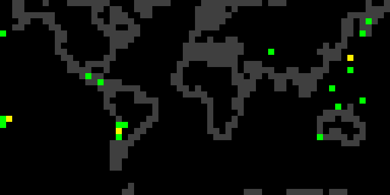

<!-- Improved compatibility of back to top link: See: https://github.com/othneildrew/Best-README-Template/pull/73 -->

# Earthquake Map Applet for Tidbyt

## Description
Displays global earthquake data for, up to, the last 30 days. Applet preferences allow the user to filter the display on a minimum earthquake magnitude and on different time scales. Additionally, the user can select the central meredian of the map to be on the Prime Merdian, International Date Line, or the user's home location.

Check out the [Tidybt][tidbyt-url] for an awesome information display for your home. If you are intereasted in developing for the Tidbyt, check out the [Tidbyt Developers Page][tidbyt-dev-url].

[Tidbyt][tidbyt-dev-url] has a process where a contributor forks the community development repository, creates a branch in the contributor's own fork, and then runs a pull request against their development branch. I am maintaining development in this repository and then copying code that is ready into a branch of the fork for the pull request.

(<a href="#readme-top">back to top</a>)

<!-- LICENSE -->
## License

Tidbyt has a specific license agreement for including an application in their community apps called the [Tidbyt Individual Contributor License Agreement][tidbyt-lic-url].

(<a href="#readme-top">back to top</a>)

<!-- ROADMAP -->
## Roadmap

See the [open issues][repository-issues] for a list of proposed features (and known issues).

(<a href="#readme-top">back to top</a>)

<!-- Built With -->
## Built With

* [Tidbyt][Tidbyt-url]
* [Tidbyt Dev/Pixlet][Tidbyt-dev-url]
* [USGS GeoJSON Feed][Usgs-feed-url]
* [Python Pillow][python-pillow-url]

(<a href="#readme-top">back to top</a>)

<!-- CONTACT -->
## Contact

Brian McLaughlin - bjmclaughlin@gmail.com

Project Link: [https://github.com/SpinStabilized/tidbyt-earthquakemap_dev][repository-url]

(<a href="#readme-top">back to top</a>)

<!-- ACKNOWLEDGMENTS -->
## Acknowledgments

* The [Tidbyt Team][tidbyt-url]
* The Tidbyt [community of developers][tidbyt-community-url]

(<a href="#readme-top">back to top</a>)

[repository-issues]: https://github.com/SpinStabilized/tidbyt-earthquakemap_dev/issues
[repository-url]: https://github.com/SpinStabilized/tidbyt-earthquakemap_dev
[python-pillow-url]: https://python-pillow.org/
[tidbyt-community-url]: https://tidbyt.dev/docs/engage/community
[tidbyt-url]: https://tidbyt.com/
[tidbyt-dev-url]: https://tidbyt.dev/
[tidbyt-lic-url]: https://github.com/tidbyt/community/blob/main/docs/CLA.md
[tidbyt-community-repo]:[https://github.com/tidbyt/community]
[usgs-feed-url]: https://earthquake.usgs.gov/earthquakes/feed/v1.0/geojson.php