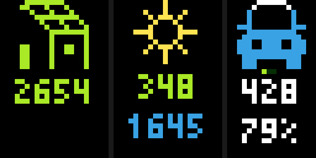
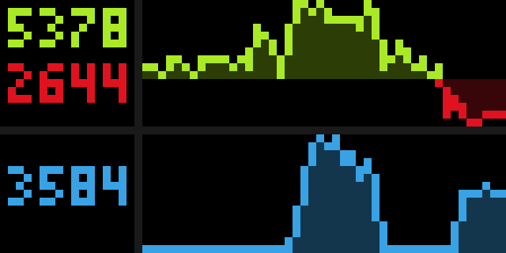

# EVCC
[evcc](https://evcc.io/en/) is an energy management system with a focus on electromobility. The software controls your EV charger or smart plug. It communicates with your vehicle, inverter or home storage to make intelligent charging decisions. This app is to display the most important statistics (excess solar power, charging power, state of charge).

# Overview



The first screen is separated into 3 columns. "current" values are averaged over the last 5 minutes and cached for 5 minutes to reduce API requests.

|column|description|evcc metric name| 
| -------- | ------- |------- |
| 1|current photovoltaic output| pvPower  |
|2|☀️ or ☢️ , depending on what is winning |gridPower |
||current grid power, green when more pvPower is generated than used, red otherwise |gridPower | 
||current charge power | chargePower | 
|3|the car is a progress bar. A blue car indicates current charging, green otherwise  |vehicleSoc | 
||🟢⚫️⚫️ indicating active charging phases  |phasesActive | 
||vehicle range |vehicleRange | 
||vehicle state of charge | vehicleSoc | 



The second screen is separated into 2 rows. Graphs are showing the last 12 hours, values are a moving average over 15 minutes and cached for 15 minutes. For "max" metrics an moving average is calculated over 5 minutes, the maximum of today is taken, cached for 5 minutes.

|row|description|evcc metric name| 
| -------- | ------- |------- |
|1|maximum photovoltaic output today| pvPower |
| | maximum grid power today|gridPower |
|2|chargePowerMax |chargePower |

> [!IMPORTANT]
> By default, when the car is not connected to a charger, SOC and range are not updated. Check evcc [loadpoint](https://docs.evcc.io/en/docs/reference/configuration/loadpoints#soc) documentation how to change this behaviour.

For more details on measurements check out the [evcc  messaging](https://github.com/evcc-io/docs/blob/main/docs/reference/configuration/messaging.md) documentation.

# Setup

## Signup to InfluxDB Cloud Serverless

Tidbyt apps are designed to query data only from public API endpoints, not from any local LAN device. evcc typically runs in your LAN on a Raspberry Pi or similar. However for security reasons exposing the evcc API endpoint to the public internet using DynDNS or so is not ideal too.

The approach is to use a [InfluxDB Cloud Serverless](https://www.influxdata.com/influxdb-cloud-pricing/) with a "Free Plan", allowing to keep 30 days of data and sufficient API requests for reading and writing data.

* Signup for InfluxDB Cloud [InfluxDB Signup page](https://cloud2.influxdata.com/signup)
* select a region of your choice (EU Frankfurt, US East (Virginia))
* create an organisation and bucket (for simplicity I called both `evcc`) 
* create an API token for writing into the evcc bucket (for evcc)
* create an API token for reading from the evcc bucket (for the Tidbyt app) 

## Setup evcc InfluxDB v2.x integration

Following [evcc InfluxDB v2.x](https://docs.evcc.io/docs/reference/configuration/influx/#influxdb-v2x) documentation, the `evcc.yaml` is configured like this:

```
influx:
  url: https://eu-central-1-1.aws.cloud2.influxdata.com # make sure this fits to the region you picked
  database: evcc # InfluxDB v2.x uses term `bucket` but for compatibility still named `database` here
  token: <YOUR WRITE TOKEN HERE>
  org: evcc # if you named your organisation differently, please adjust here
```

Restart your evcc and check the logs for errors.

## Verify your setup

Use the InfluxDB "Data Explorer" to verify evcc is able to send metrics.

* select the bucket `evcc`
* pick measurement `gridPower` or any other
* run the query

You should see some query results matching the statistics of your evcc installation.

# Tidbyt App configuration

* pick the region you used for InfluxDB 
* enter the InfluxDB read API key
* change InfluxDB bucket name when needed
* enter the name of your vehicle as it is displayed in evcc (some metrics won't work otherwise)
* the location needs to match your InfluxDB timezone (relevant for the graphs)

# Credits

Icons were created by my colleague Alvaro, who is abstinent from social media, hence no link here.