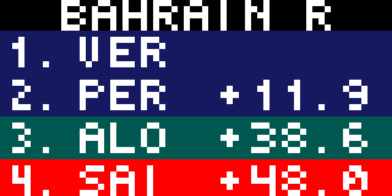

With the start of the new F1 season, I've made an app that shows qualifying and race results for the latest round with some additional options for the race. Note that this is not a live timing app!

Qualifying Result:

Race Result:

Race result with timing gaps to winner:

Race result with position change, comparing grid to finish:

Next race:

Credit to @AmillionAir for the idea and a special shoutout to @jvivona for providing a hosting for an alternate API
