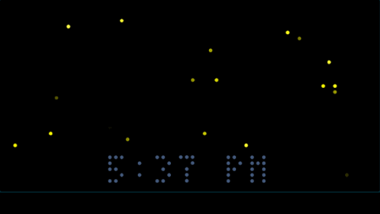
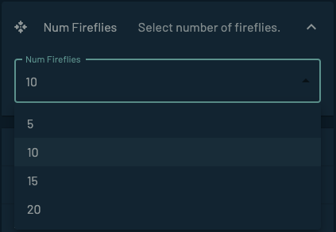
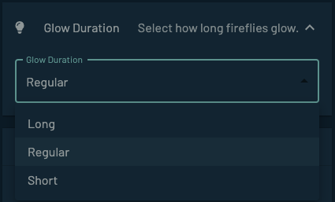
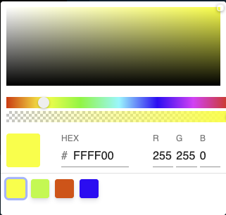
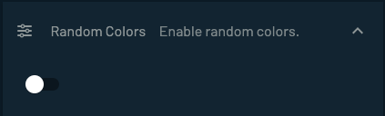
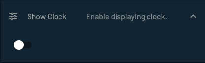
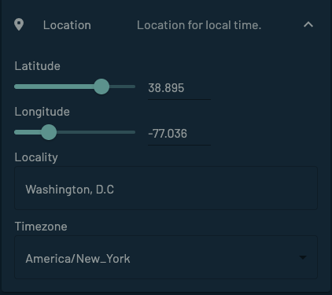

## Fireflies

---

##### <i>Introduction</i>

Fireflies, often referred to as "nature's tiny lanterns," captivate the imagination of people worldwide. Known scientifically as Lampyridae, these insects are famous for their fascinating ability to emit light. This unique feature is not just a magical spectacle for the eyes, but also a significant element in the firefly's enchanting life cycle.

Most notable among fireflies are those belonging to the species that produce bio-luminescence during twilight to attract mates or prey. The light is generally green, yellow, or orange-red, but blue or violet light is also possible. The dedicated sequence and frequencies at which these lights flash serve as complex communication systems between individuals.

It is hard to match these colors perfectly to HTML colors due to variations among species and differences in perception caused by environment and individual biology. Approximations might look something like this:

     Yellow:     #FFFF00
     Green:      #ADFF2F  (It's generally a kind of light, slightly yellowish green.)
     Orange-Red: #FF4500  (This color might be seen when the luminance is weak or from a distance. Only a few species radiate this color.)
     Faint Blue: #0000FF  (This is a much rarer color for a firefly to emit.)

The radiance of fireflies has a surreal and mesmerizing beauty that dots the night landscape, rendering a celestial-like spectacle on earth. Think of them as the stars within our grasp, flickering erratically yet rhythmically, painting the black canvas of night with unpredictable strokes of light. Their shimmer amid the quiet of the night offers both a sense of tranquility and a tingly excitement.

This can be used as a night display that replaces a nightlight in your room.
 

##### <i>Tidbyt Screen</i>
The screen has the option to dislay the fireflies with or without the current time (<b>5:37 PM</b>). The toggle for displaying the time is via the schema.

<i>Fireflies with no time showing</i>

<i>Fireflies with the current time</i>

Fireflies are not displayed if they occur in the area of the clock.

 

##### <i>Schema</i>
The following schema data can be entered via the Tidbyt app:

<i>Select the number of fireflies from the list {***5***, ***10***, ***15***, ***20***}.  The default is {***10***}.</i>

<i>Select how long the fireflies glow from the list {***Long***, ***Regular***, ***Short***}. The default is {***Regular***}.</i>

<i>Select the color of the fireflies.  The default is {***Yellow***}.  There are also four choices from the palette corresponding to the HTML colors that best approximate the more general firefly colors described above.</i>
   

<i>When random colors is selected, every firefly has a different color chosen randomly.  The default is {***Off***}.</i>

<i>Select whether to display the time on the bottom of the screen.  The default is {***Off***}.</i>

<i>You can change the location if you do not want to used the default location from your mobile device.</i>

