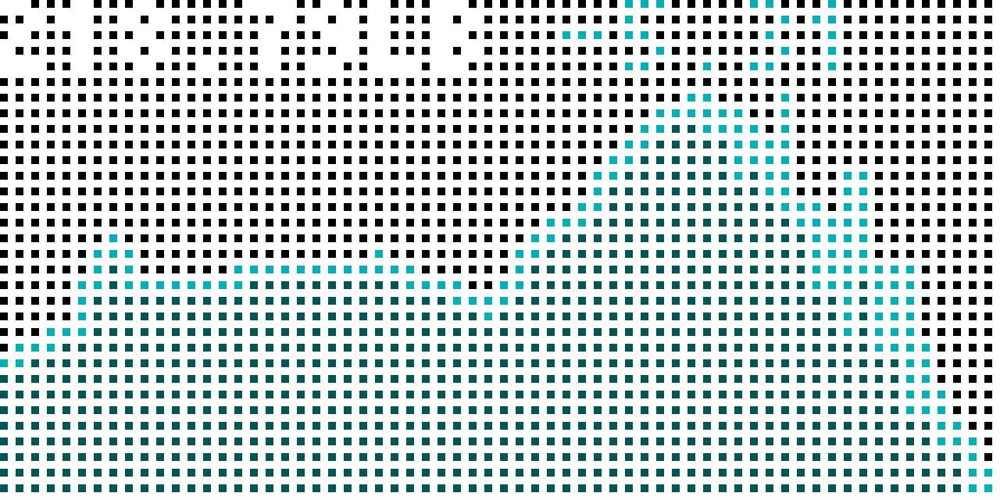

# FitbitWeight for Tidbyt

Displays your weight, and optionally, your body fat percentage or BMI from Fitbit. You can enter your data manually into Fitbit, or you can get a supported scale like the Aria to automatically update your fitbit whenever you weight yourself.

Motivate yourself by displaying your progress!

