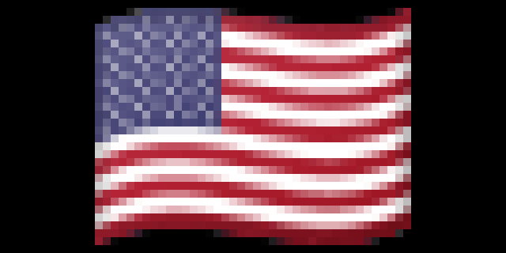
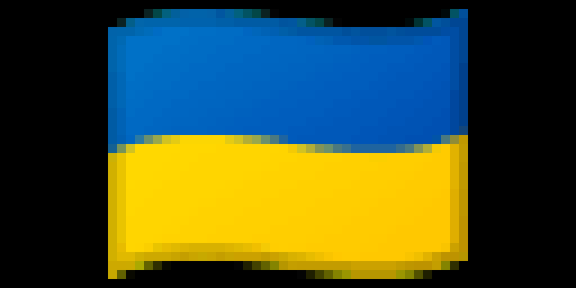
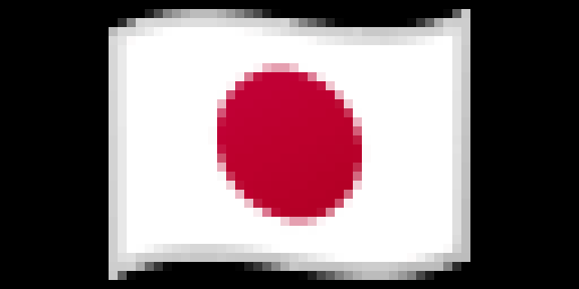

# Flags!

Made by: [btjones](https://github.com/btjones/)

Displays a country flag on your Tidbyt. The flag can either be a specific country flag or a random flag.

## Flagpedia

Public domain flag images are provided by [flagpedia.net](https://flagpedia.net/). Country codes correspond to ISO 3166-1 alpha-2 & ISO 3166-2:GB country codes as noted by Flagpedia. All flag images are 40x30.

## Potential Future Improvements

- [x] Add option to show country name.
- [x] Some flags that use the color black can blend in with the Tidbyt screen. Potentially add a background color flags with this issue or even all flags.
- [ ] Could add other types of flags. States, territories, schools, etc.
- [ ] Update flags, names, and codes as those change over time.
- [ ] Allow user to select a flag style option - waving or flat.

## Screenshots

