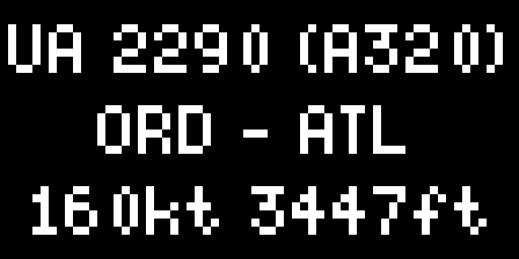

# Flight Overhead for Tidbyt

Use AirLabs or OpenSky to find the flight overhead a location. By default, OpenSky is the provider. An optional OpenSky account can be used to extend the request quota. An AirLabs API Key is required to use AirLabs as the provider.

>>>
name = "Provider (Required)",
desc = "The provider for the data"

name = "Location (Required)",
desc = "The decimalized latitude and longitude to search"

name = "Radius",
desc = "The radius (in nautical miles) to search"

name = "AirLabs API Key",
desc = "An AirLabs API Key is required to use AirLabs as the provider"

name = "OpenSky Username",
desc = "An OpenSky account can be used to extend the request quota"

name = "OpenSky Password",
desc = "An OpenSky account can be used to extend the request quota"

name = "Provider TTL Seconds",
desc = "The number of seconds to cache results from the provider"

name = "Show Route",
desc = "Some providers can often display incorrect routes"

name = "Limit",
desc = "Limit the number of results to display"

name = "Return Message on Empty",
desc = "The message to return if no flights are found"

## Screenshot

## Credit

Thank you to [The OpenSky Network](https://opensky-network.org), [HexDB](https://hexdb.io), and [ADSB.lol](https://www.adsb.lol) for providing free access to their data.
