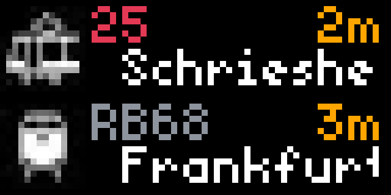

# German Transit

German Transit displays upcoming public transportation departures for the selected station. Modalities include U-Bahn, S-Bahn, Tram (Straßenbahn), Bus, Regional Train, and ICE Trains.  The data is sourced from Verkehrsverbund Rhein-Neckar (VRN), however the user can select any station in Germany (and even some neighboring cities, e.g. Strasbourg).

## Display

- Up to 8 upcoming departures, 2 at a time

## Configuration
- Select train station based on specified location
- If desired, select offset time to filter out departures within the selected number of minutes
- Toggle on/off specific modes of transportation

## Screenshot

