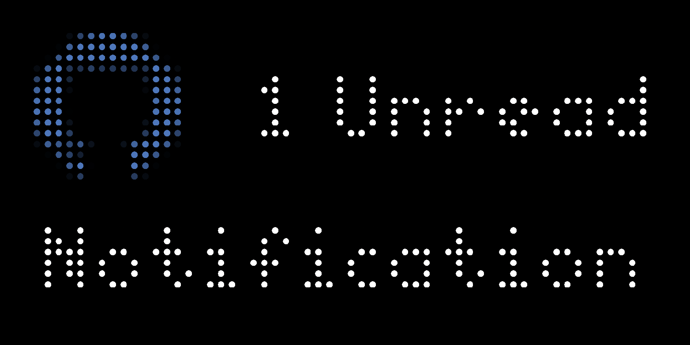

# Github Unread
Shows the current number of unread notifications on the linked GitHub. Requires a [personal access token](https://docs.github.com/en/authentication/keeping-your-account-and-data-secure/creating-a-personal-access-token) to use and uses the [Notifications API](https://docs.github.com/en/rest/activity/notifications?apiVersion=2022-11-28).

