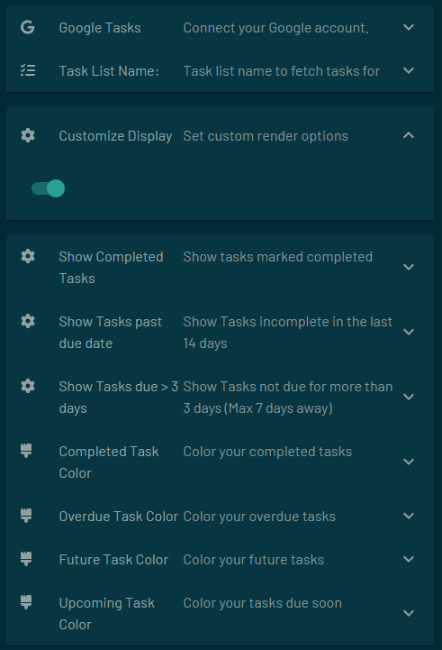

# Google Tasks Integration for Tidbyt

[Google Tasks](https://support.google.com/tasks/answer/7675772?hl=en) is a to-do list from Google. Manage, capture, and edit your tasks from anywhere, at anytime, with to-dos that sync across all your devices. Integrations with Gmail and Google Calendar help you get tasks done—faster.

This app displays the tasks in your list ordering by the due date. Will grab tasks that are past due, completed or upcoming. To use this app, you must have a Google account and use the Google Tasks service.

The task List Name option is case sensitive - and must match exactly what your list is called.

## Customization
### Task List Selection:
Specify the task list to fetch tasks from using the schema.Text field.
- Set the default task list name to streamline task retrieval.
### Display Options:
Customize the display options to control which tasks are shown:
- Toggle to show completed tasks.
- Toggle to show past-due tasks.
- Toggle to show tasks due more than 3 days in the future.
### Color Customization:
Customize the colors associated with different task states:
- Completed tasks.
- Overdue tasks.
- Future tasks.
- Tasks due soon.

## Testing
Mock Data for Testing:
-Enable the TEST flag to test the app with mock data.
-Configure test scenarios using the TEST_CONFIG dictionary.

## Notes
This app is not created by, affiliated with, or supported by Google.
