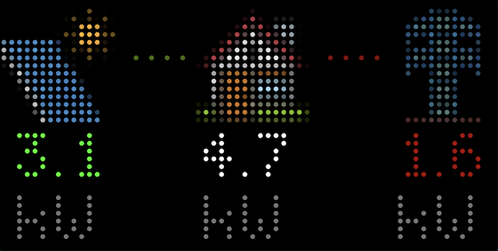

# Solar Monitoring Applet using Home Assistant for Tidbyt

## About

Displays real-time solar panel production data from your solar installation.



When fully set up, the following screens are displayed:

- Power flow (grid, solar, load, battery)
- Battery state of charge and power flow (charge, discharge)
- Solar power production
- Power consumption
- Daily energy production and consumption
- Autarky (today, week, month, year)
- Energy used for EV charging (today, week, month)
- EV battery state of charge

## Setup

The applet requires a Home Assistant installation reachable via the internet (either through Home Assistant Cloud or your own port forwarding setup).

The long-lived access token can be generated on the Profile / Security page (`${ha_url}/profile/security`).

The applet expects entities which represent solar power generation, energy consumption, etc. How you set up these entities depends on the integration providing access to the meter data.

For SolarEdge, there are some good examples here:

- https://github.com/WillCodeForCats/solaredge-modbus-multi/wiki/Template-Sensors-for-Power-and-Energy                      
- https://gist.github.com/thargy/f9713cd6c06bc77a22a4b323ed0f83af

The daily, weekly, monthly, and yearly statistics can be modelled as [utility meters](https://www.home-assistant.io/integrations/utility_meter/).

The autarky entities could be computed based on utility meters using [template sensors](https://www.home-assistant.io/integrations/template/), for example:

```
{{ (float(states("sensor.energy_consumption_day"), 0) - float(states("sensor.grid_import_day"), 0)) / float(states("sensor.energy_consumption_day"), 0) * 100 }}
```
