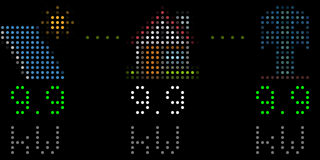
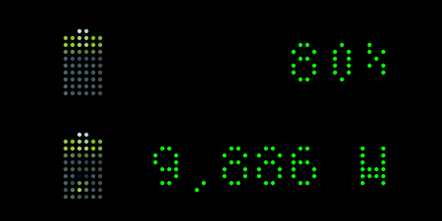
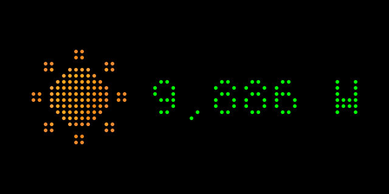
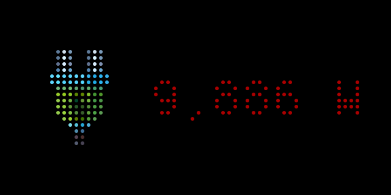
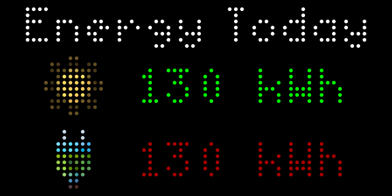
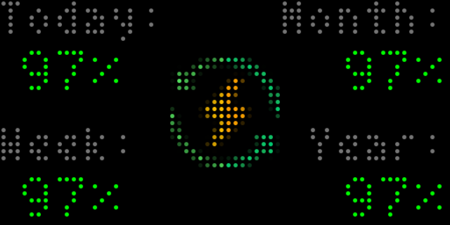
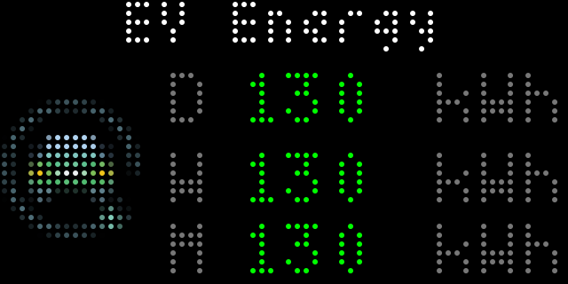
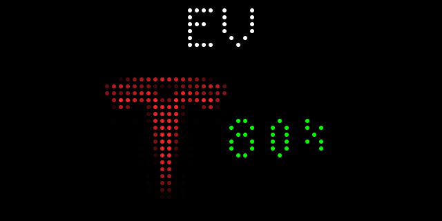

# Solar Monitoring Applet using Home Assistant for Tidbyt

## About

Displays real-time solar panel production data from your solar installation.



When fully set up, the following screens are displayed:

- Power flow (grid, solar, load, battery)
- Battery state of charge and power flow (charge, discharge)
- Solar power production
- Power consumption
- Daily energy production and consumption
- Autarky (today, week, month, year)
- Energy used for EV charging (today, week, month)
- EV battery state of charge

## Installation

Just open the Tidbyt app, click on the “+” icon at the lower right and then
search for "HASS Solar" in the search field.

## Setup

The applet requires a Home Assistant installation reachable via the internet
(either through Home Assistant Cloud or your own port forwarding setup).

The long-lived access token can be generated on the Profile / Security page
(`${ha_url}/profile/security`).

The applet expects entities which represent solar power generation, energy
consumption, etc. How you set up these entities depends on the integration
providing access to the meter data.

For SolarEdge, there are some good examples here:

- https://github.com/WillCodeForCats/solaredge-modbus-multi/wiki/Template-Sensors-for-Power-and-Energy
- https://gist.github.com/thargy/f9713cd6c06bc77a22a4b323ed0f83af

The daily, weekly, monthly, and yearly statistics can be modelled as
[utility meters](https://www.home-assistant.io/integrations/utility_meter/),
for example:

```
utility_meter:
  energy_production_month:
    source: sensor.energy_solar_production
    cycle: monthly
    always_available: true
```

The autarky entities could be computed based on utility meters using
[template sensors](https://www.home-assistant.io/integrations/template/), for
example:

```
sensor:
  - name: "Autarky Day"
    unit_of_measurement: "%"
    state: "{{ (float(states("sensor.energy_consumption_day"), 0) - float(states("sensor.grid_import_day"), 0)) / float(states("sensor.energy_consumption_day"), 0) * 100 }}"
    availability: "{{ has_value('sensor.energy_consumption_day') and has_value('sensor.grid_import_day') }}"
```

## Screens

### Main screen


This screen shows the following information:

- Solar production on the left. Green animated flow moving from left to right.
  - Value is always green or grey when it reaches zero. Once solar production
    reaches zero, the solar planel icon is replaced with a battery icon which
    displays the SOC status of the battery
  - Battery discharge is shown with a yellow flow animation. If no discharge is
    happening, the flow animation disappears
  - For installations without a battery, the solar icon is not replaced.
- Consumption in the middle
- From or to grid on the right
  - Red value with red animated flow when energy is consumed from the grid
  - Green value with green animated flow when energy is provided to the grid

Be aware that power flowing from the solar panels directly to your battery will
not be shown in the middle consumption value. So if you see a difference
between the production and consumption value, your battery is likely charging.
Details regarding the battery can be found on the "Battery" screen.

The main screen requires entities for the following configuration options:

- Current solar power (`entity_power_solar`)
- Current grid power (positive = export, negative = import) (`entity_power_grid`)
- Current load power (consumption) (`entity_power_load`)

If you have a battery, additionally configure the following:

- Current battery power (positive = charging) (`entity_power_battery`)
- Current battery state of charge (charging level) ()`entity_soc_battery`)

The screen is shown by default but can be hidden with the `show_main` option.

### Battery



This screen shows the following information:

- SOC state of the battery. Animation changes from red (0-25%) to orange
  (25-50%) to yellow (50-75%) and green (75-100%) depending on how full your
  battery is.
- Charge / discharge state of the battery in Watts. Shows a green animation if
  the battery is being charged. Shows a red animation if the battery is being
  discharged.

The battery screen requires entities for the following configuration options:

- Current battery power (positive = charging) (`entity_power_battery`)
- Current battery state of charge (charging level) ()`entity_soc_battery`)

The screen is hidden by default but can be shown with the `show_char` option.

### Production



This screen shows the following information:

- Current solar production in Watts. Value is always green until it reaches
  zero.

The production screen requires entities for the following configuration options:

- Current solar power (`entity_power_solar`)

The screen is hidden by default but can be shown with the `show_prod` option.

### Consumption



This screen shows the following information:

- Current consumption in Watts. Value is always red.

The consumption screen requires entities for the following configuration
options:

- Current load power (consumption) (`entity_power_load`)

The screen is hidden by default but can be shown with the `show_cons` option.

### Energy summary



This screen shows the following information:

- Daily summary of:
  - Solar production so far in kWh. This value is rounded as there is no space
    for decimals.
  - Consumptoin so far in kWh. This value is rounded as there is no space for
    decimals.

The energy summary requires entities for the following configuration options:

- Energy production today (`entity_energy_production`)
- Energy consumption today (`entity_energy_consumption`)

The screen is shown automatically as soon as both options are configured.

### Autarky



This screen shows the following information:

- Autarky for today
- Autarky for the current week
- Autarky for the current month
- Autarky for the current year

It requires entities for the following configuration options:

- Autarky ratio today (`entity_autarky_day`)
- Autarky ratio in the current week (`entity_autarky_week`)
- Autarky ratio in the current month (`entity_autarky_month`)
- Autarky ratio in the current year (`entity_autarky_year`)

The screen is shown automatically as soon as all options are configured.

### EV Energy



This screen shows the energy used by a wallbox for charging an electric
vehicle for today, this week, this month, and this year.

It requires entities for the following configuration options:

- Energy used for charging today (`entity_energy_ev_day`)
- Energy used for charging this week (`entity_energy_ev_week`)
- Energy used for charging this month (`entity_energy_ev_month`)

The screen is shown automatically as soon as all options are configured.

### EV State of Charge



This screen shows the current state of charge for an electric vehicle.

It requires entities for the following configuration options:

- Current EV state of charge (`entity_soc_ev`)

The screen is shown automatically as soon as all options are configured.

You can further customize the screen with the following options:

- EV Name: Just enter the name of your car
- EV Brand: You can pick from a list of car brands
  - Audi
  - BMW
  - Cupra
  - FIAT
  - Hyundai
  - Opel
  - Renault
  - Seat
  - Skoda
  - Tesla
  - VW

If your SOC sensor can become unavailable (for example, when the car is
sleeping), but you want to show the last known state, you can use a
trigger-based template sensor like this:

```
template:
  - trigger:
      - platform: state
        entity_id: sensor.ev_battery
        not_to:
          - unknown
          - unavailable
    sensor:
      - name: EV SOC
        state: '{{ trigger.to_state.state }}'
        state_class: measurement
        device_class: battery
        unit_of_measurement: '%'
```

If you want to display multiple car screens, you need to add an additional
Tidbyt instance for the additional car. Make sure you also always enter your
token at the very top of the app details page.

## Important information about selecting multiple screens to be displayed

Each screen comes with animations that show what is going on. These animations
only work if not more than one screen is selected from the main menu. If you
select more than one, all screens will be displayed, but animations will not
show.

If you like to have each screen animated, you need to run a separate instance
for each screen. You do this by just adding the app again in your Tidbyt app,
pasting the URL and token information again and then selecting the screen you
would like to have displayed.

This is a little tedious, but you only need to do this once per individual
screen.

## Other settings

At the bottom of the app settings you can also choose how long each screen
will be displayed on your Tidbyt. You can chose between 1-5 seconds.

## Self-hosting

The `raw_values` setting at the very bottom of the app setting can be useful
when rendering the app from within Home Assistant. In this mode, you can pass
the actual values instead of entity IDs in the respective settings. The ap
will then not call the Home Assistant API and does not require an access token.

The units used are `kWh` (energy), `W` (power), and `%` (state-of-charge).

Whenever you want to display fresh values, you'll need to render this app
(`pixlet render`) and upload it to the Tidbyt cloud (`pixlet push`).
