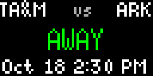

# HomeGame

Never miss your team's next game! HomeGame displays upcoming college football game information on your Tidbyt with live countdowns, scores, and home/away indicators.

## Features

- **76+ College Teams** - Select from dropdown or enter any ESPN team ID
- **Live Countdown** - Real-time timer on game day
- **Live Scores** - Quarter-by-quarter updates during games
- **Home/Away Indicator** - Visual distinction between home (red) and away (green) games
- **Smart Display** - Automatically shows date, countdown, or live score based on game status

## Display Modes

The app adapts based on game timing:

- **Upcoming**: Shows game date and kickoff time
- **Game Day**: Live countdown with solid color background
- **In Progress**: Real-time scores with quarter/period (Q1-Q4, OT, FINAL)

## Configuration

Choose your team from the dropdown (SEC, Big Ten, Big 12, ACC, Pac-12, and more) or enter a custom ESPN team ID. Set your location for accurate game times.

## Documentation

- **[DEPLOY.md](DEPLOY.md)** - Deployment guide and troubleshooting
- **[DEV_README.md](DEV_README.md)** - Full documentation for developers
- **[DEVELOPMENT.md](DEVELOPMENT.md)** - Development workflow and testing

## Author

Created by tscott98 and Claude 🤖
