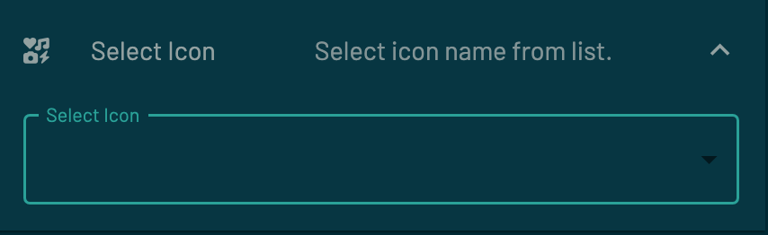
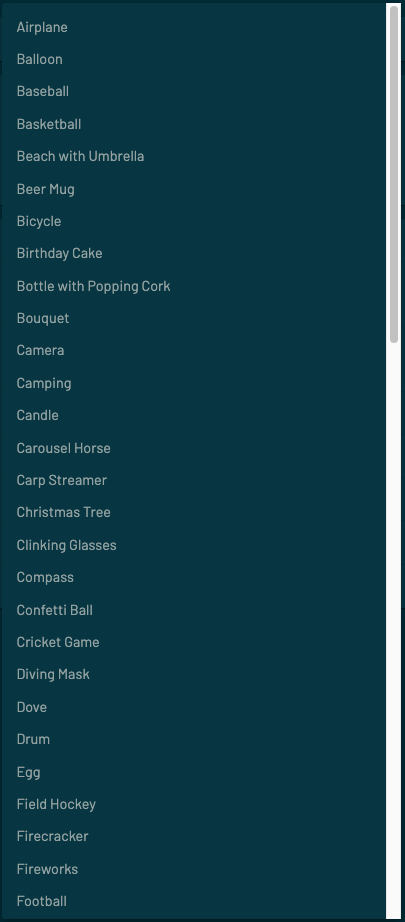
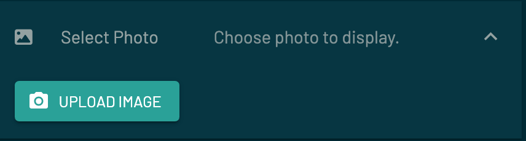
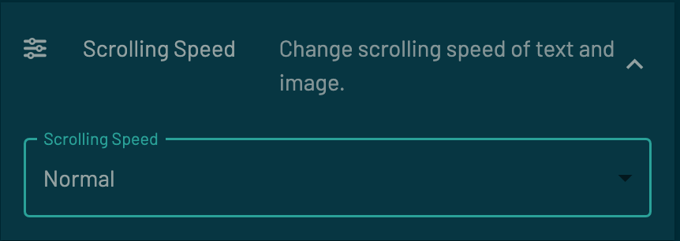
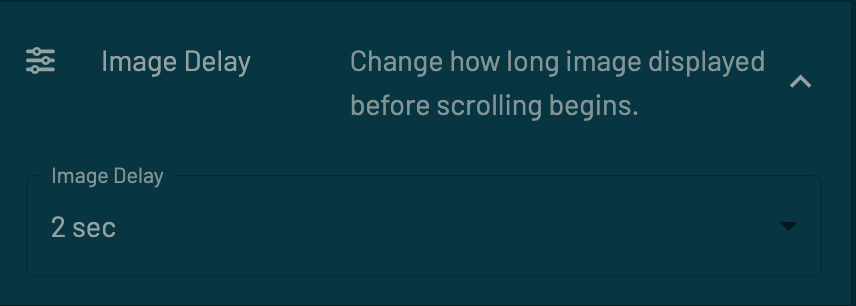
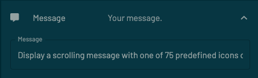
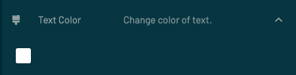
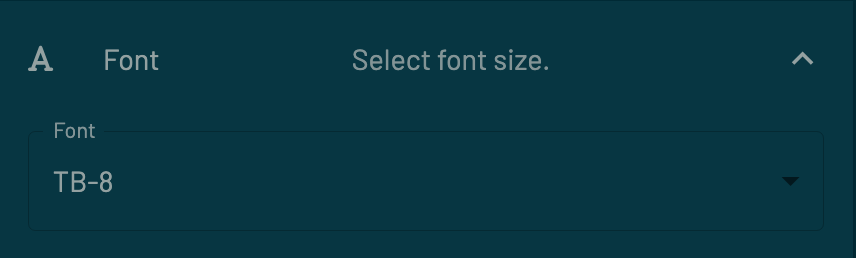
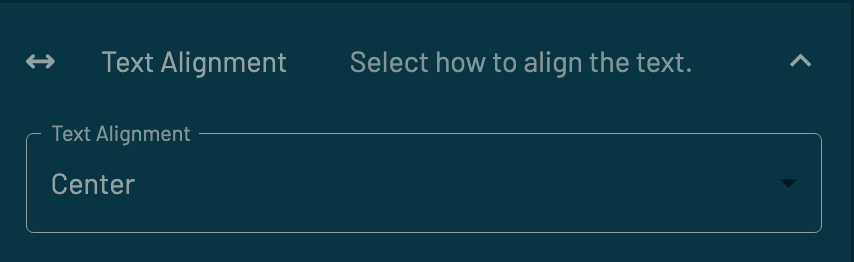
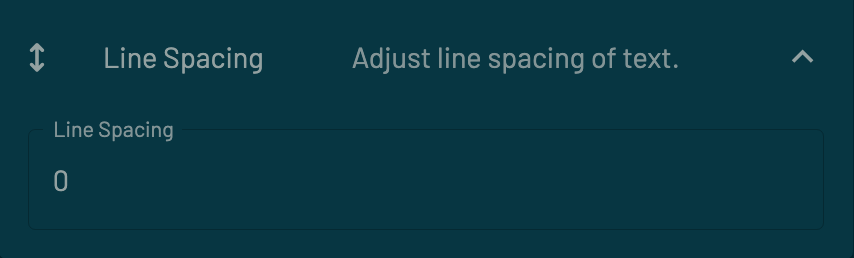

## IcoNote

---

This Tidbyt app lets you display a scrolling message with one of the 75 predefined icons or your photo.

  

 You have the choice to select one of the following icons:

<i>
Airplane, Balloon, Baseball, Basketball, Beach with Umbrella, Beer Mug, Bicycle, Birthday Cake, Bottle with Popping Cork, Bouquet, Camera, Camping, Candle, Carousel Horse, Carp Streamer, Christmas Tree, Clinking Glasses, Compass, Confetti Ball, Cricket Game, Diving Mask, Dove, Drum, Egg, Field Hockey, Firecracker, Fireworks, Football, Fork and Knife with Plate, Four Leaf Clover, Full Moon, Gift, Glowing Star, Golf, Guitar, Historic Landmark, Ice Hockey, Jack-O-Lantern, Lion, Man Dancing, Medal, Menorah, Microphone, Military Medal, Mountain, Mrs. Claus, Musical Note, National Park, Palm Tree, Party Popper, Partying Face, Performing Arts, Rabbit Face, Racing Car, Rainbow, Red Envelope, Red Heart, Red Paper Lantern, Roller Coaster, Rose, Sailing, Santa Claus, Saxophone, Ship, Skis, Soccer Ball, Sparkler, Studio Microphone, Suitcase, Sunglasses, Surfing, Tennis Ball, Turkey, Volleyball, Woman Dancing
</i>

The icons consist of the more popular ones for celebrations/holidays, vacation/travel, and sports.

The display starts with the icon or photo you choose.  After a delay that is conttrolled by you, the message will begin to scroll vertically.  If there is no message, then only the image is display.

The schema consists of the following data:
<table>
  <tr>
    <td> Select whether you want to display an icon or your photo.</td>
    <td>   </td>
  </tr>
  <tr>
    <td> Select the icon you want to displayed.</td>
    <td>  </td>
  </tr>
  <tr>
    <td> Choose one of your photos to display.</td>
    <td> </td>
  </tr>
   <tr>
    <td> Select the scrolling speed.</td>
    <td> </td>
  </tr>
  <tr>
    <td> Select the image delay - how long to display the image before scrolling starts.</td>
    <td> </td>
  </tr>
  <tr>
    <td> Enter your message.</td>
    <td> </td>
  </tr>
   <tr>
    <td> Select the color for the text.</td>
    <td> </td>
  </tr> 
  <tr>
    <td> Select font size.</td>
    <td> </td>
  </tr>
  <tr>
    <td> Select text alignment.</td>
    <td> </td>
  </tr> 
  <tr>
    <td> Adjust the line spacing.</td>
    <td> </td>
  </tr>
</table>
 
