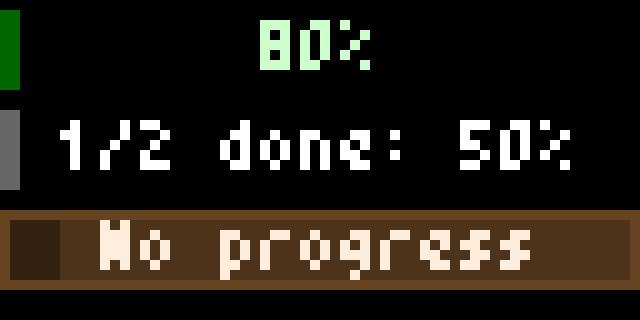

# JSON Status for Tidbyt

Displays JSON Status for one or more items by fetching a provided URL.



Retrieves a JSON with progress status that may return up to 4 elements, showing status of each element on the Tidbyt display.

Can be used to expose data around usual long running activities - such as rendering, 3D printing - as long as the data can be exported and displayed.

## JSON file contents

The JSON file should be in the form of:

```json
{
  "items": [
    {
      "label": "optional label",
      "color": "#RRGGBB or #RGB"
      "progress": 1.0
    },
    {
      "label": "3D printing",
      "progress": 0.01
    }
  ]
}
```

The `progress` field should be a floating point value between `0.0` and `1.0`, inclusive.

**NOTE**: All fields in each item are optional:

- items without a label are shown without any text information
- items without progress are shown as animations, can be used to show jobs/operations without progress information
- color defaults to white if not provided
