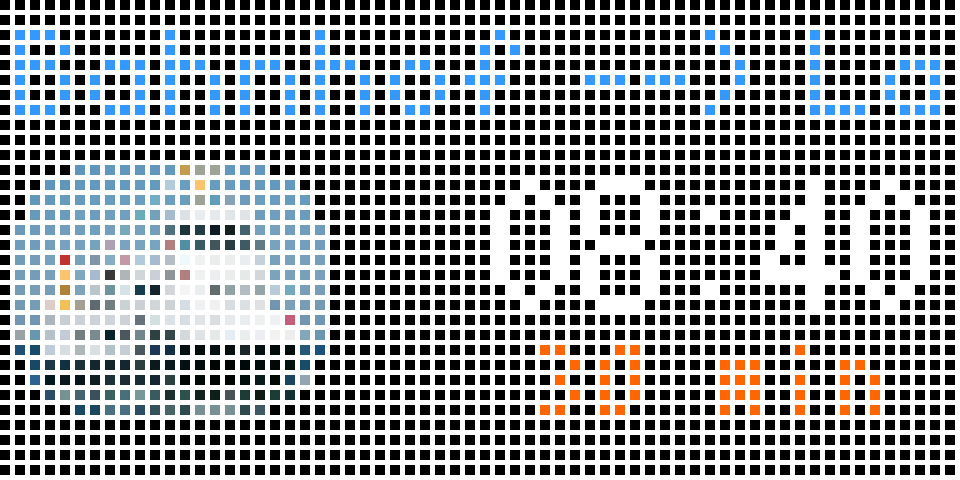

# Kiel Harbor Ferry Departure Times Applet for Tidbyt

Displays the next Kiel harbor ferry departure and wait time. Any ferry stop and direction from
the [Kiel harbor ferry system](https://www.sfk-kiel.de) may be configured.

Departures are retrieved from the Deutsche Bahn public API via the 
[DB REST wrapper](https://github.com/derhuerst/db-rest) hosted publicly
at https://v5.db.transport.rest/.

