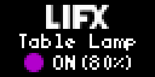

# LIFX Lights

## Overview

[LIFX](https://www.lifx.com) is a recognized brand of multi-colored and wi-fi enabled smart bulbs. It offers a [public API](https://api.developer.lifx.com/reference/introduction), where you can get information like power state, color and brightness from your lights, making it possible to display it on a Tidbyt.

This app was designed with this in mind.

It currently displays the light name, color, power and brightness:

The name will scroll (with a marquee) if it's too large and the blinking can be disabled. When the light is off, the colored circle will have just an outline to show the last color it had and the brightness percentage will be hidden.

## API Authentication

LIFX does have an OAuth2 enabled API, but currently it's only avaiable for partner companies like Google, Amazon and IFTTT.

Light owners can access the API by generating "Personal Access Tokens" at the [LIFX Cloud Portal](https://cloud.lifx.com). Thus, this app requires that users go through this setup process before it can be used.

We might contact LIFX support in the future and try to apply to be able to use the OAuth2 endpoints, making the app more user friendly.

## Rate Limiting

The API is rate limited, with the rate being applied on a per access token basis.

The current limit is 120 requests every 60 seconds, so it's more than enough for the app to be able to call it every time without needing Tidbyt's caching features.

## Configuration (Schema)

The app's `get_schema` function was designed with the `Generated` widget. The user first needs to supply their Personal Access Token then a second method is called to list the user's lights and display a `Dropdown` with the available options.

The user can also select if the light color indicator should blink on the screen.

## Error Handling

The app was designed with safeguards to identify potential errors and always display something on the screen, without ever needing to call the `fail` function.

We currently handle these scenarios:

- API errors: any error that occurs when calling the LIFX APIs.
- Configuration errors: errors that might occur during the app configuration such as an invalid personal access token or the user having no lights registered on their account.

## Demo/Setup Mode

The app also has a demo/setup mode so it can be previewed by users on the Tidbyt app before going through the configuration process.

## Other details

Some notable functions in the code are `hsb_to_rgb` and `get_faded_color_frames`.

LIFX uses the HSB (hue, saturation, brightness) color scheme, so the first function converts it to the hex color format expected by Tidbyt.

If you check the GIF image above you'll see that the colored circle has a nice effect where it fades to black and back. The second method calculates all the intermediary colors needed for this effect and returns a list of frames that is used in a `render.Animation` widget.
