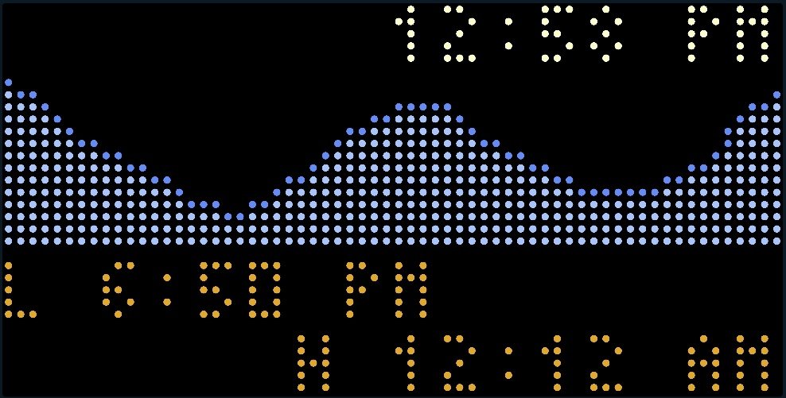
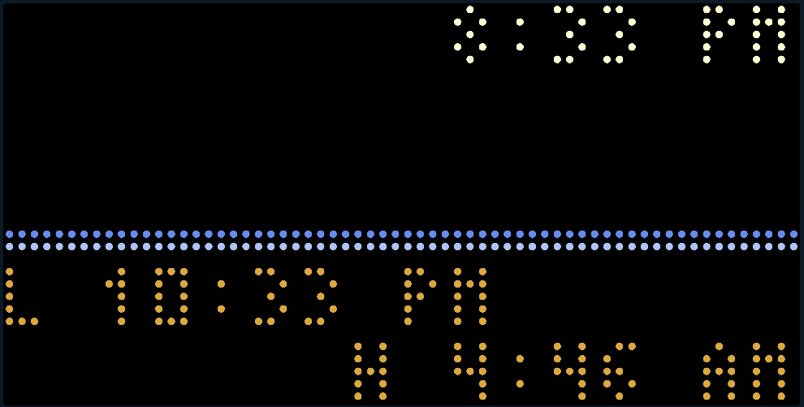
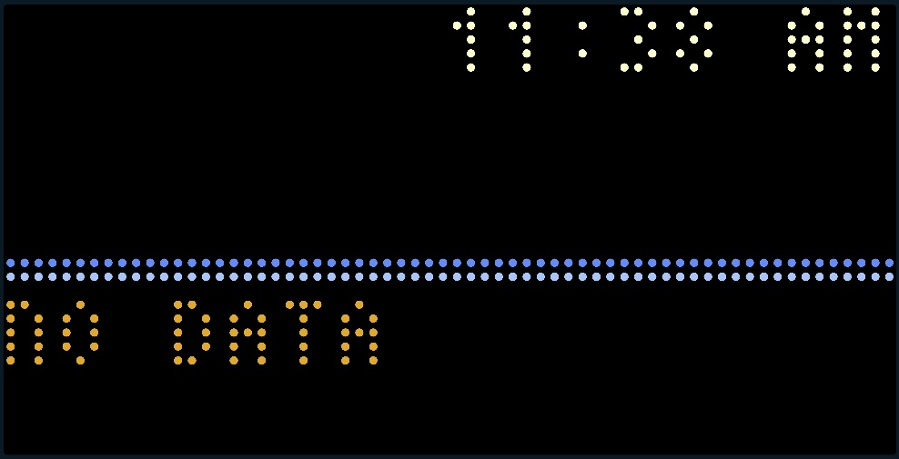
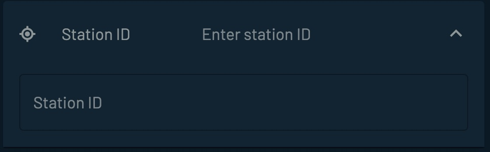
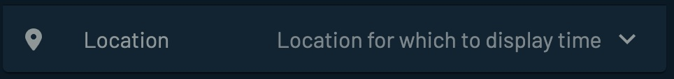

## Local Tides

---

##### <i>Introduction</i>
This app uses data from the NOAA website to render a 24-hour tide graph using hourly values and the next two high/low tide event times.

Use the link https://tidesandcurrents.noaa.gov/tide_predictions.html to locate the Station ID for your closest station.

The NOAA provides tide predictions for two <i>classifications</i> of stations - <b>Harmonic</b> and <b>Subordinate</b>.

<u>Harmonic stations</u> are stations with tidal harmonic constants and tidal datums. Tide predictions for harmonic stations are generated directly from the harmonic constants. Harmonic stations have the greatest capabilities within the NOAA Tide Predictions service for providing predictions with different data intervals and relative to different tidal datums.

<u>Subordinate stations</u> are historic stations which do not have tidal harmonic constants available. Tide predictions for subordinate stations are generated by first generating high/low tide predictions for a designated harmonic station, called the “reference station”; then time and height adjustments are applied to correct the high/low predictions to the tidal conditions at the subordinate station. <u>Subordinate stations only allow for the generation of high/low tide predictions</u>.

For this reason when selecting the station from the Web site, you should select <b>Harmonic</b> and not Subordinate if you want the high/low graph to display data.
 
##### <i>Tidbyt Screen</i>
The screen displays the current time (<b>12:58 PM</b>), a graph showing the hourly heights normalized to the maximum height for the displayed 24-hour period, and two lines giving the times for the next two tide events. The first line will be the time of the next tide event and whether it is a high (<b>H</b>) or low (<b>L</b>) tide.  Stations with Subordinate predictions will have a zero line graph, and will only show the times of the next two tide events.

<i>Using a Harmonic Station ID</i>

<i>Using a Subordinate Station ID</i>

If the Station ID is entered incorrectly, the following screen will display because no valid data is received.

<i>IncorrectStation ID</i>

 
##### <i>Schema</i>
The schema data that are entered via the Tidbyt app are the Station ID and location.

 

