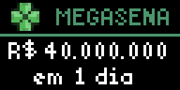

# Loterias do Brasil

## Overview

The [Loteria](https://loterias.caixa.gov.br/) is the official Brazilian lottery. This app displays the estimated prize value and how much time you have left until to bet until the next draw, for the various modalities of the loteria.

Example:

**Note:** since this app is targeted at Brazilian people, all the text displayed by the app and in the schema configuration options is in Brazilian Portuguese.

---

## API Details

This app uses the same public API that powers the Loteria [portal](https://loterias.caixa.gov.br/). There is a single API call where the modality is informed and all data needed by the app is returned.

### Authentication

The API requires no authentication.

### Rate Limiting

It is unknown if the API is rate limited.

Results are cached for 1 hour using the built-in caching provided by the `http` module.

---

## Error Handling

The app handles API errors, generates logs and has a different display mode to indicate there was an error.

The `fail` function is never used.

---

## Future Improvements

There are many things that could be made to improve this app:

- Design: the current design is very simple but straight to the point.
- Cycle (animate) between estimated and accumulated values, instead of showing one or the other.
- Have a different display (or "screen") to show past results.
- Support some seasonal modalities like the "Mega da Virada", which happens only once a year during new years eve.
