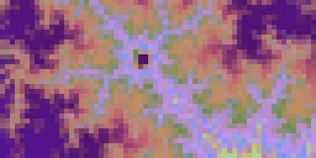
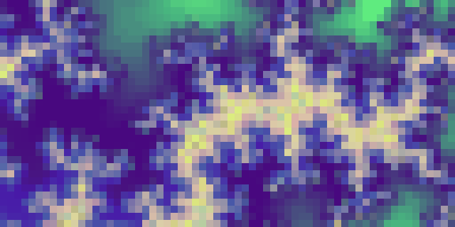
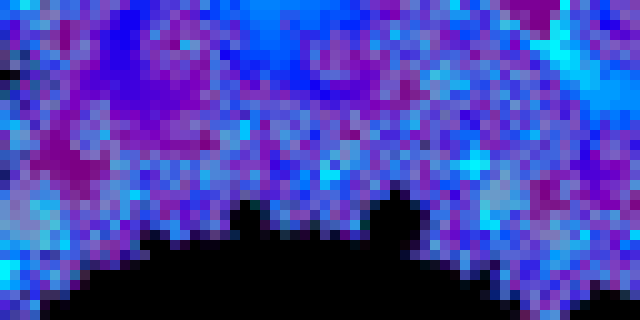
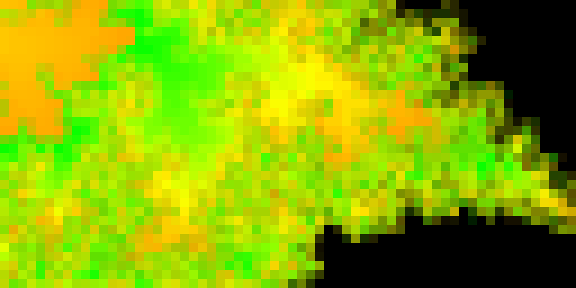
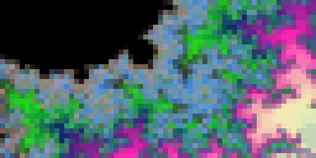
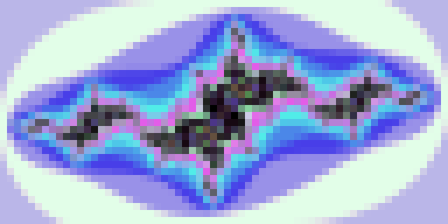

# Mandelbrot
Displays a random image from the mandelbrot or julia set.
Searches for a random point of interest to focus on.

## Settings

### Oversample
Creates a higher resolution image and then downsamples the result with anti-aliasing. 
Oversampling is very slow, and higher settings are likely to time out on the
Tidbyt servers. Defaults to 2xAA.

### Adaptive AA
If on, performs up to 32 passes of a spiraling resample. This has a somewhat similar effect
to oversample anti-aliasing but is incremental and less likely to cause a timeout.
Defaults to on.

### Gradient
How should we color this fractal? Stick with "randomized" for a randomly-created 
32-step color gradient, or pick a preferred palette from the list. Defaults to
randomized.

### Julia
Switch on to display a julia set instead of a mandelbrot. This will be 
centered around the whole fractal, using the mandelbrot's
point of interest as the "c values." Because it is not zoomed in, iteration
count is lower and the entire thing can be rendered faster. Defaults to off.

### Normalize Brightness
If on, alters the result to utilize the full luminosity of the display.
Defaults to on.

### Contrast Correction
If on, stretches the color ranges to provide sharper contrasts. Defaults 
to on.

### Gamma Correction
If set to greater than 1.0, adjusts sets a monitor gamma point. Allegedly.
Defaults to off.

## Gallery

