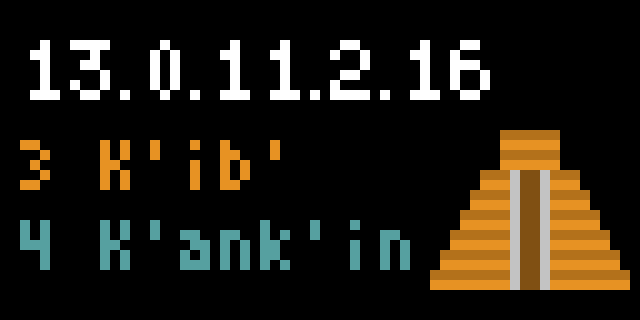

# Maya Calendar

Displays today’s date in the calendar systems used by the ancient Maya civilization of Mesoamerica.

## Calendars

The Maya calendar system consists of three calendars:

1. **Long Count** — a continuous count of days since August 11, 3114 BCE (using the generally accepted Goodman-Martínez-Thompson correlation). The count is displayed in a *mostly* base-20 format as follows:

* 1 day = 1 k’in
* 20 k’in = 1 winal
* **18** winal = 1 tun
* 20 tun = 1 k’atun
* 20 k’atun = 1 b’ak’tun

Any date in history up to October 13, 4772 CE can be represented uniquely with a 5-place Long Count value.

The transition of the Long Count from 12.19.19.17.19 to 13.0.0.0.0 (start of the 14th b’ak’tun) was at the center of a widely publicized panic that the world would end on December 21, 2012. It has been widely reported that this did not happen.

2. **Tzolk’in** — a sacred 260-day calendar, combining a sequence of 20 named days with a sequence of 13 numbered days.

3. **Haab’** — a 365-day calendar that *roughly* approximates the solar year. It consists of 18 months of 20 days each, followed by a period of five “nameless” days called Wayeb’.

The combination of Tzolk’in and Haab’ dates is called the **Calendar Round**, and repeats approximately every 52 years. The Calendar Round is still used today by some Maya communities in Guatemala.

Names given for Tzolk’in days and Haab’ months are in the Yucatec Maya language, in the standardized and revised orthography of the Guatemalan *Academía de Lenguas Mayas*. Other orthographies for Yucatec Maya exist. The corresponding names in the Quiché language range from slightly different to completely different from the Yucatec Maya names.

## What’s new

**Version 1.1.0:** Added correlation options; minor display change; improved app description.

## Future improvements

A rich set of glyphs exists for the Tzolk’in day names and Haab’ month names. While possibly too intricate for the Tidbyt’s resolution, it might be possible to rotate through one set of these instead of using the single Kukulcan’ image.

## References

* [The Maya Calendar Explained](https://www.mayaarchaeologist.co.uk/public-resources/maya-world/maya-calendar-system/)
* [The Mayan Calendar](https://pauahtun.org/Calendar/Default.htm)
* [Living Maya Time ](https://maya.nmai.si.edu/calendar)
* [Wikipedia: Maya calendar](https://en.wikipedia.org/wiki/Maya_calendar)

## About this app

Version 1.1.0 (2023-12-20, 13.0.11.2.16  3 K’ib’ 4 K’ank’in) by [Doug Ewell](http://ewellic.org)
