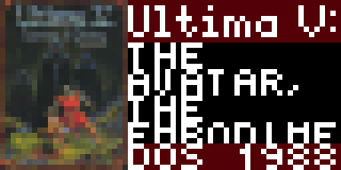

MobyGames
==================

This app uses the [MobyGames API](https://www.mobygames.com/info/api/) to select a random game from the [MobyGames](https://www.mobygames.com/) database. It then displays the cover thumbnail, the title, description, MobyScore, and first platform and release date.

Here are a few screenshots showing the app in action:




## Development

Feel free to make changes to this app. You simply need to request an API key from MobyGames to get started.

The following commands will be useful to you when developing locally (e.g. when running `pixlet render`):

1. `api_key` (required): the API key to use when making requests to the MobyGames API when running locally
2. `debug` (optional): set to this to `true` if you want to print debug statements to the console
3. `bypass_cache` (optional): Set to this to `true` if you DO NOT want to cache data and instead want to always pull from network sources.

Here's an example of using all of these paramters to render the app locally:

```
pixlet render moby_games.star api_key=my_api_key debug=true bypass_cache=true
```

You can also render the app using `pixlet serve` (the above parameters simply need to be passed to the url)

The app makes a single request to the [games/random](https://www.mobygames.com/info/api/#gamesrandom) api, and loads 100 games. This data is cached for 1 hour, so within that hour, you'll see renders of games randomly selected out of those initial 100.

Each time the render takes place, a random game is selected from the 100 that were loaded, and information about that game is displayed.

## Future Possible Improvements

These are things I may do, or any other developer is welcome to do so as well:

* Explore the MobyGames API in further detail to see if there's more useful data to ingest - e.g. developer, publisher (I see this information on the MobyGames site, but not in sample requests to their API, so this may require reaching out to MobyGames to see if they're interested in exposing these details)
* Add in more data to what's displayed, such as genres, or additional platforms and release dates beyond just the first
* Introduce a schema to allow for customization, though this will require some thought. For example, it'd be nice to allow users to filter by Genre, but this will require a more nuanced usage of MobyGames' APIs - they don't support filters in their "random" API, and on top of that, the Tidbyt cache is per app id, which means it is shared across all users.