# Piet Mondrian-inspired clock for Tidbyt

Displays the time with a beautiful, unique composition De Stijl for each minute of the day.

## Reading the clock
### Digital clock
As you learn to read the clock faces, I suggest leaving the configuration for the digital clock face set to True.

### Hours
Hours are displayed next to the red block on the top.
A thin white block is merely decorative (for 12 and 6 displays). A thicker column or two of white blocks indicates actual hours. If the red block has moved to the left side of the display, that equals 6 hours.

### Five Minute Increments
Five minute intervals are displayed in the bottom left. When the blue box is on the top row, it expands until it fits 25. Conversely, when the blue box is on the bottom row, it expands until it fits 55. The 15 and 45 have convenient grey boxes next to them to make them easier to read.

### One Minute Increments
There is a one minute mark in the bottom right. If the big one is yellow, it means to add 0 to the five-minute-read. There is then a box with four smaller boxes in them. The top left means to add one, top right to add two, bottom left to add three, and bottom right to add four.

### Walk-through
Below I have included 12 images that I believe will help you understand how to read the clock better.

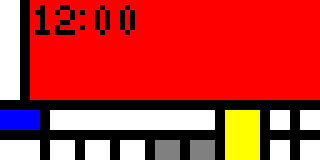

Hr: 0 = Thin white column / Red

5m: 0 = Blue box doesn't reach 3 white and 2 grey tick marks, less than 30 so top row

1m: 0 = Big box is yellow

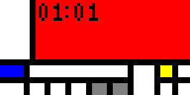

Hr: 1 = White column of 1 / Red

5m: 0 = Blue box doesn't reach 3 white and 2 grey tick marks, less than 30 so top row

1m: 1 = Top left box is yellow

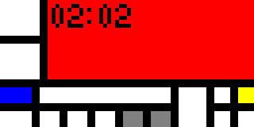

Hr: 2 = White column of 2 / Red

5m: 0 = Blue box doesn't reach 3 white and 2 grey tick marks, less than 30 so top row

1m: 2 = Top right box is yellow

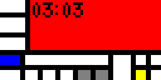

Hr: 3 = White column of 3 / Red

5m: 0 = Blue box doesn't reach 3 white and 2 grey tick marks, less than 30 so top row

1m: 3 = Bottom left box is yellow

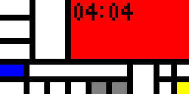

Hr: 4 = White column of 3 / White column of 1 / Red

5m: 0 = Blue box doesn't reach 3 white and 2 grey tick marks, less than 30 so top row

1m: 4 = Bottom right box is yellow

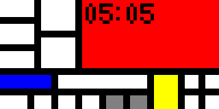

Hr: 5 = White column of 3 / White column of 2 / Red

5m: 1 = Blue box reaches 1st tick mark, less than 30 so top row

1m: 0 = Big box is yellow

Hr: 6 = Red / Thin white column

5m: 3 = Blue box reaches 3rd tick mark (just before the quarter marking grey box), less than 30 so top row

1m: 0 = Big box is yellow

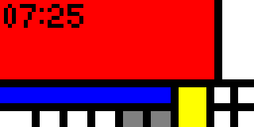

Hr: 7 = Red / White column of 1

5m: 5 = Blue box reaches 5th (final) tick mark, less than 30 so top row

1m: 0 = Big box is yellow

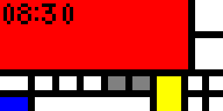

Hr: 8 = Red / White column of 2

5m: 0 (past 30) = Blue box doesn't reach 3 white and 2 grey tick marks, (more than or) equal to 30 so bottom row

1m: 0 = Big box is yellow

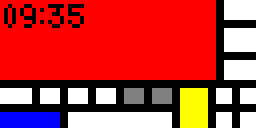

Hr: 9 = Red / White column of 3

5m: 1 (past 30) = Blue box reaches 1st tick mark, (more than or) equal to 30 so bottom row

1m: 0 = Big box is yellow

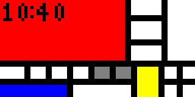

Hr: 10 = Red / White column of 3 / White column of 1

5m: 2 (past 30) = Blue box reaches 2nd tick mark, (more than or) equal to 30 so bottom row

1m: 0 = Big box is yellow

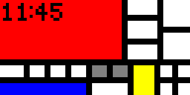

Hr: 11 = Red / White column of 3 / White column of 2

5m: 3 (past 30) = Blue box reaches 3rd tick mark (just before the quarter marking grey box), (more than or) equal to 30 so bottom row

1m: 0 = Big box is yellow

## Like my programming?
Reach out to me on github [@theredwillow](https://github.com/theredwillow)