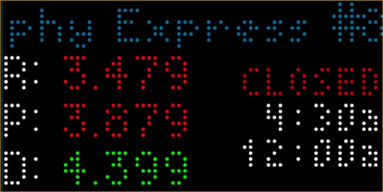

# Murphy USA Gas Applet 

Displays current gas prices for a selected [Murphy USA](https://www.murphyusa.com) gas station.

## Features

* Using an entered address, choose from a list of the nearest 10 stations within 20 miles of the address (if no stations found - will show "No Station within 20 miles")
* The applet will display the prices (as availble at the station) for Regular (R), Premium (P), and Diesel (D)
* Choose the color scheme for gas prices: all white, red for gas and green for diesel, or green for gas and red for diesel
* Device will display OPEN or CLOSED (based on current device time) followed by the open and close times for today
* Open/Close hours will reference the station's local operating hours

## Thanks

Thanks a lot to @dja852 for [Costco Gas](../costcogas/) as it was the starting point for this app.

## Screenshot

