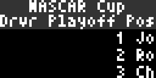
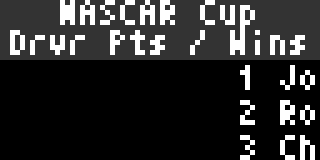
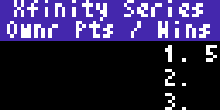
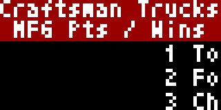

# NASCAR Next Race

NASCAR Next Race displays next race details, current standings details or playoff details for the series you select

Displayed:

- Next Race
  - Series Title w/corresponding background
  - Race Name
  - Track Name
  - Date / Time (localized)
  - US TV channel showing the race

- Standings (Driver / Owner / Manufacturer)
  - Series Title w/corresponding background
  - Top 9 drivers/owners/mfgs in 3 scrolling rows
  - includes position, name, points and wins
  - Owner Standings adds the car # in front of owner's name

- Playoffs (Driver Only)
  - Series Title w/corresponding background
  - Top 9 drivers
  - includes position, name, PLAYOFF points and CURRENT PLAYOFF ROUND wins

## Configuration
- Select series to display (cup series is default)
- Select Display Type (next race or standings)
- Select Text Color
- For Next Race select display option to fade or slide and date/time format

## Thanks

Thanks a lot to @AMillionAir as a lot of the original version of this applet was based on the work he did on the [Forumla 1 applet](../formula1/).

## Screenshot

 
 

