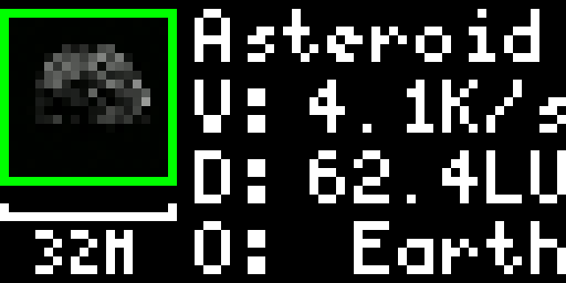

# NEOTrack - Near Earth Object Tracker

Shows the closest object on approach to Earth today according to [NASA's Near Earth Object Webservice (NeoWs) API](https://api.nasa.gov/#asteroids-neows).

Shows the following information:

In the lefthand pane:

- The estimated max size of the asteroid (diameter in kilometres or metres)
- A green border denotes the object is safe, an orange border means it's potentially dangerous[^1]

Righthand pane:

- The official name of the asteroid
- `V`: The relative velocity in Kilometres per Second
- `D`: The closest approach distance in [Lunar Units (LU)](https://en.wikipedia.org/wiki/Lunar_distance_(astronomy))
- `O`: The asteroid's orbiting body

[^1]: A potentially hazardous object (PHO) is a near-Earth object whose orbit brings it within 4.7 million miles (7.5 million km) of Earth’s orbit, and is greater than 500 feet (140 meters) in size. 